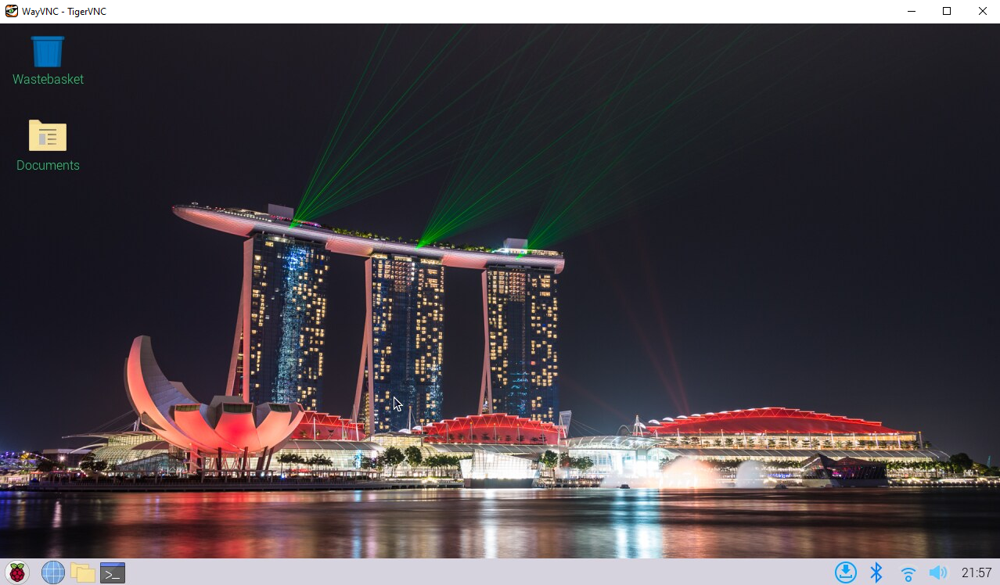

# Lab 1A: Raspberry Pi Setup

## Raspberry Pi Imager Install

After Installing the Imager and writing to the SD card. I used the tutorial to have a headless setup with my RaspberryPi 4.  

  

Then I set up the desktop preferences to my liking

  

My local IP is 192.168.1.233 and the MAC Address is DC:A6:32:B3:0C:45  

  

  

# Lab 1B: Raspberry Pi Configuration

## Raspberri Pi Configuration  

I changed the hostname from raspberrypi to joepi just to make it easier to type when I want to use it next  

Regarding changing the network at boot setting, it was not available under those preferences, but I would not want to do that anyway, since I am using a headless setup and would like to have access right away.  

  

  

  

# Lab 1C Startup Mailer  

After following the steps in the lab, I was able to recieve an email on my stevens email from the gmail account that I used. Since I used a current email address, I covered the name.

  

# Lab 1D SSH and VNC  

instead of VNC Viewer, I am using TigerVNC which does the same thing but updated. I am also using PuTTY as an SSH, which is how I configured the headless setup with my Raspberry Pi.

Below is a picture of me shelled into to my Raspberry Pi and showing TigerVNC connected to the display of my device  

  

