# Lab 10A: Blockchain

## Hash function with randomization

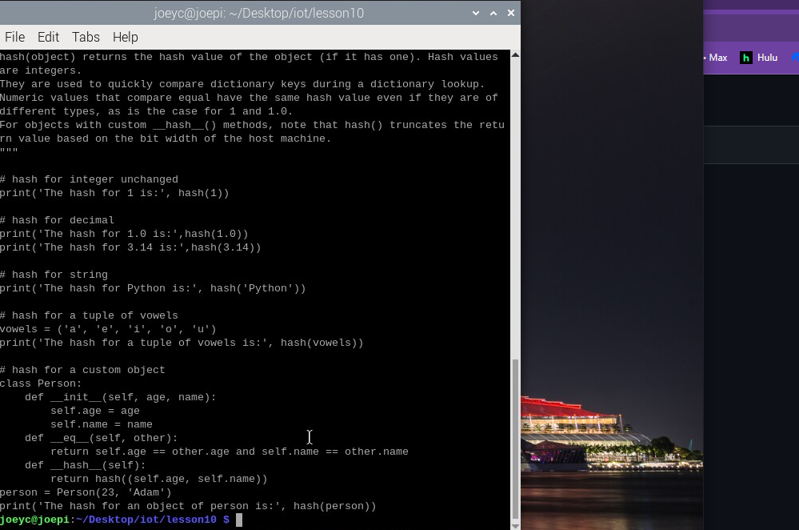
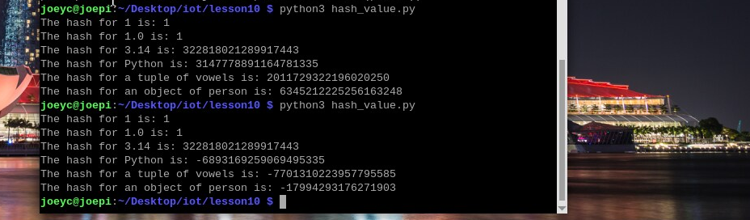

## SHA-2 Secure Hash Algorithm

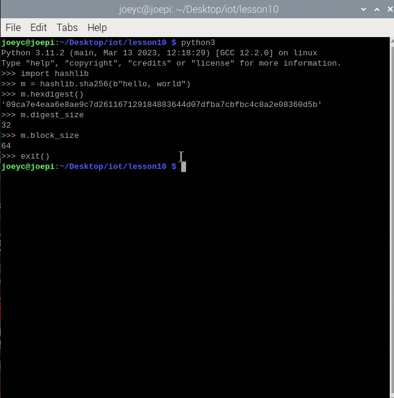

## Build the tiniest blockchain in less than 50 lines of Python by Gerald Nash (2017-07-16)

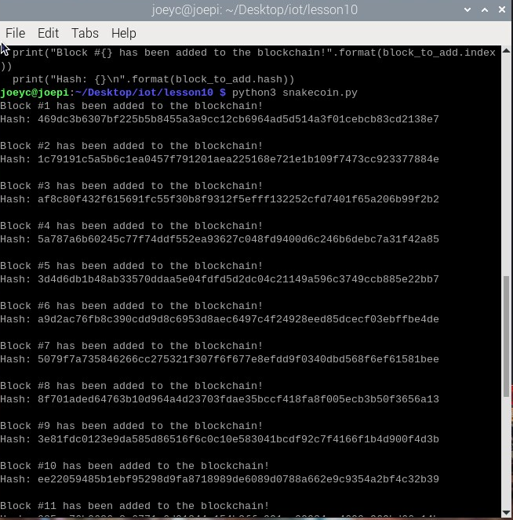
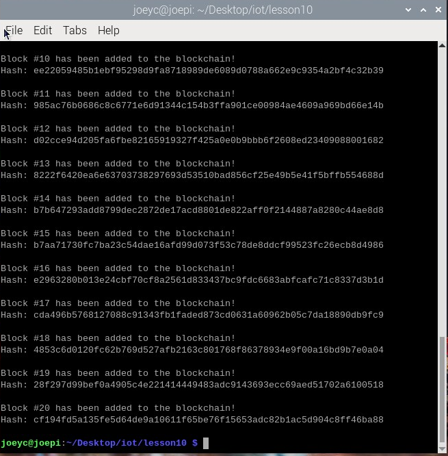

## Let’s Make the Tiniest Blockchain Bigger Part 2: With More Lines of Python by Gerald Nash (2017-07-23)

Terminal 1  

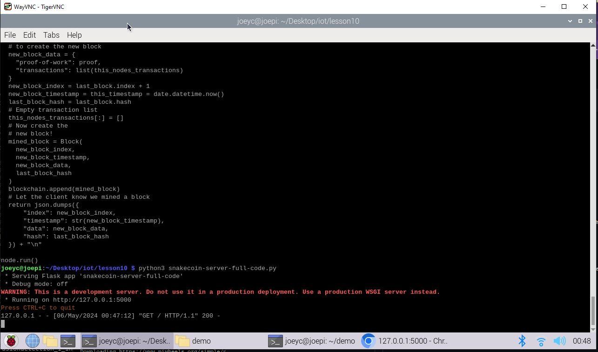
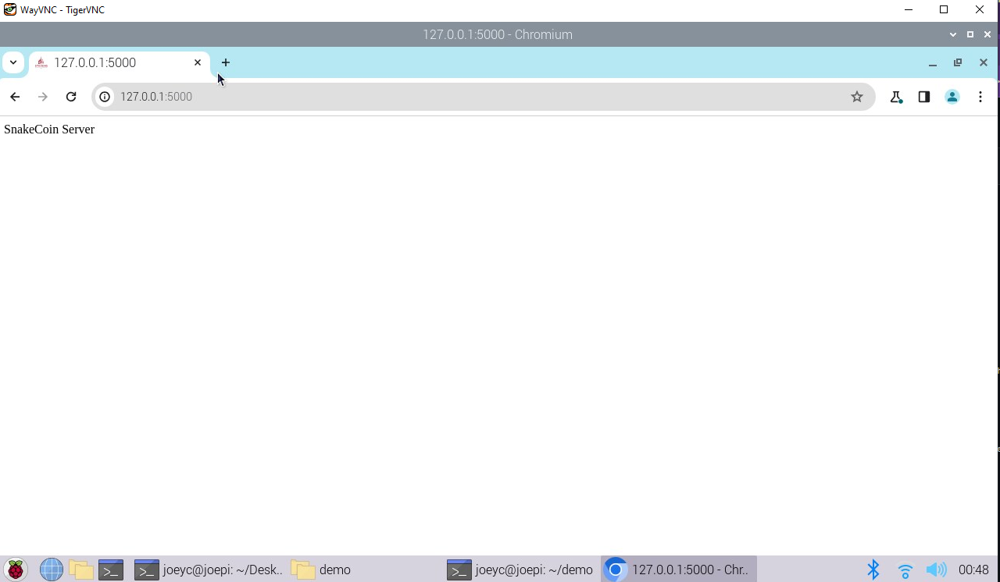

Terminal 2  
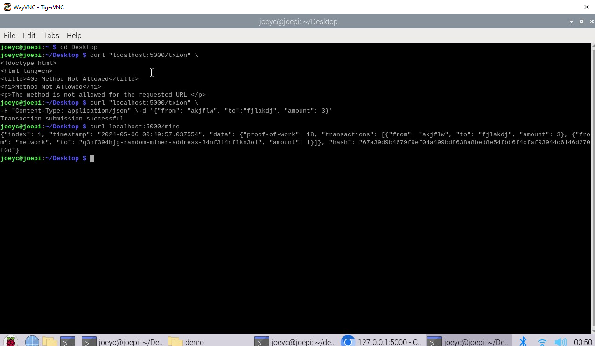
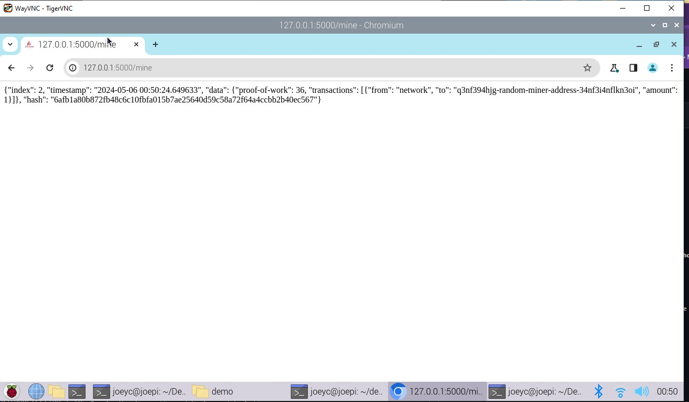

## Python blockchain app by Satwik Kansal

Terminal 1
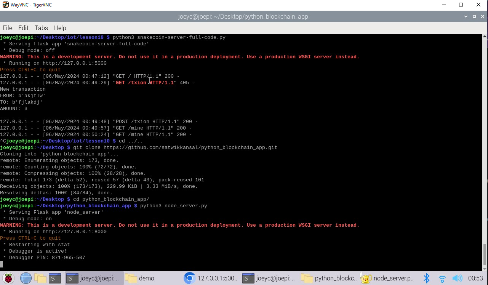

Terminal 2
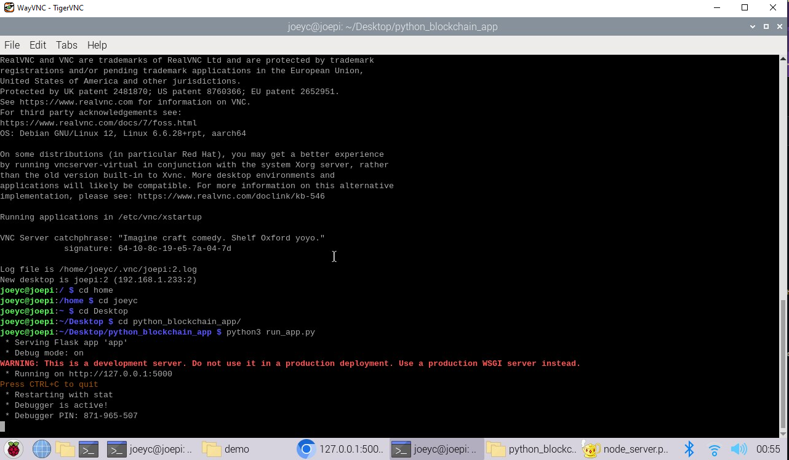

Browser
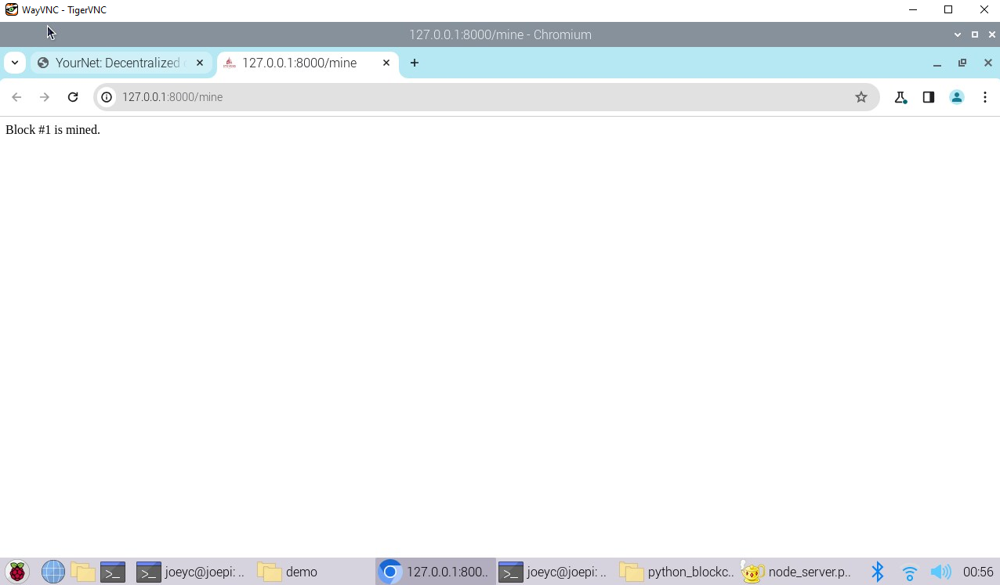
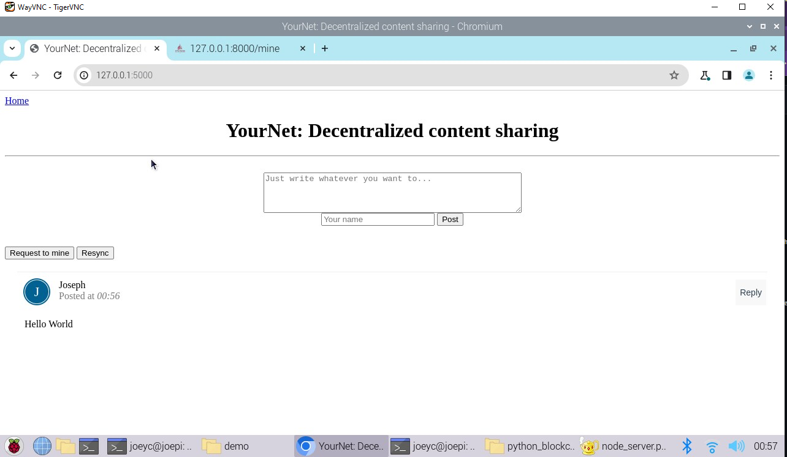

