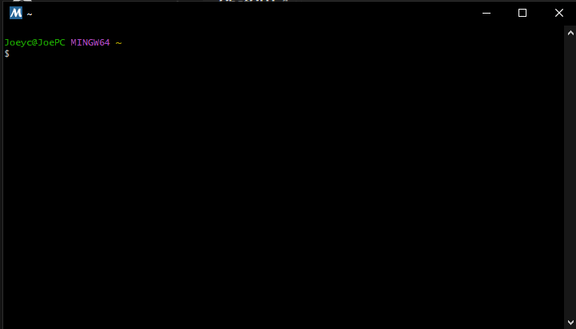

# Lab 02 - Linux Terminal Commands

This lab involves running a series of commands in a Linux terminal. The unix terminal I used to complete this lab was mingw64, since I am running a windows device.

## hostname

**Description:** Show or set the system host name.

**Command:** `hostname`

**Output:**
```
JoePC
```


## env

**Description:** Run a program in a modified environment or print current environment variables.

**Command:** `env`

**Output:**
```
ProgramFiles(x86)=C:\Program Files (x86)
!::=::\
CommonProgramFiles(x86)=C:\Program Files (x86)\Common Files
asl.log=Destination=file
SHELL=/usr/bin/bash
NUMBER_OF_PROCESSORS=16
FPS_BROWSER_USER_PROFILE_STRING=Default
PROCESSOR_LEVEL=6
TERM_PROGRAM_VERSION=3.6.3
JULES_LAUNCHER_PATH=C:\Program Files\JulesApp\JulesApp.exe
MINGW_PREFIX=/mingw64
ACSvcPort=17532
PKG_CONFIG_PATH=/mingw64/lib/pkgconfig:/mingw64/share/pkgconfig
USERDOMAIN_ROAMINGPROFILE=JOEPC
HOSTNAME=JoePC
PROGRAMFILES=C:\Program Files
MSYSTEM=MINGW64
PATHEXT=.COM;.EXE;.BAT;.CMD;.VBS;.VBE;.JS;.JSE;.WSF;.WSH;.MSC
ORIGINAL_TEMP=/c/Users/Joeyc/AppData/Local/Temp
MINGW_CHOST=x86_64-w64-mingw32
OS=Windows_NT
NVM_SYMLINK=C:\Program Files\nodejs
HOMEDRIVE=C:
MSYSTEM_CARCH=x86_64
USERDOMAIN=JOEPC
PWD=/home/Joeyc
USERPROFILE=C:\Users\Joeyc
OneDriveConsumer=C:\Users\Joeyc\OneDrive
MANPATH=/mingw64/local/man:/mingw64/share/man:/usr/local/man:/usr/share/man:/usr/man:/share/man
PRINTER=HP66F5CA (HP Color LaserJet Pro M478f-9f)
TZ=America/New_York
MINGW_PACKAGE_PREFIX=mingw-w64-x86_64
ALLUSERSPROFILE=C:\ProgramData
ORIGINAL_PATH=/c/Windows/System32:/c/Windows:/c/Windows/System32/Wbem:/c/Windows/System32/WindowsPowerShell/v1.0/
CommonProgramW6432=C:\Program Files\Common Files
HOME=/home/Joeyc
USERNAME=Joeyc
OneDrive=C:\Users\Joeyc\OneDrive
COMSPEC=C:\WINDOWS\system32\cmd.exe
APPDATA=C:\Users\Joeyc\AppData\Roaming
SYSTEMROOT=C:\WINDOWS
LOCALAPPDATA=C:\Users\Joeyc\AppData\Local
COMPUTERNAME=JOEPC
INFOPATH=/mingw64/local/info:/mingw64/share/info:/usr/local/info:/usr/share/info:/usr/info:/share/info
TERM=xterm
NVM_HOME=C:\Users\Joeyc\AppData\Roaming\nvm
LOGONSERVER=\\JOEPC
ACLOCAL_PATH=/mingw64/share/aclocal:/usr/share/aclocal
USER=Joeyc
PSModulePath=C:\Program Files\WindowsPowerShell\Modules;C:\WINDOWS\system32\WindowsPowerShell\v1.0\Modules
RlsSvcPort=22112
BESIEGE_UNITY_ASSEMBLIES=C:/Program Files/WindowsApps/SpiderlingStudios.5821136CAA5A2_1.0.18.0_x64__a408ere9ra7h8/Besiege_Data\Managed/
TEMP=/tmp
MSYSTEM_CHOST=x86_64-w64-mingw32
ORIGINAL_TMP=/c/Users/Joeyc/AppData/Local/Temp
SHLVL=1
PROCESSOR_REVISION=9e0d
DriverData=C:\Windows\System32\Drivers\DriverData
COMMONPROGRAMFILES=C:\Program Files\Common Files
LC_CTYPE=en_US.UTF-8
PROCESSOR_IDENTIFIER=Intel64 Family 6 Model 158 Stepping 13, GenuineIntel
SESSIONNAME=Console
PS1=\[\e]0;\w\a\]\n\[\e[32m\]\u@\h \[\e[35m\]$MSYSTEM\[\e[0m\] \[\e[33m\]\w\[\e[0m\]\n\$
PKG_CONFIG_SYSTEM_LIBRARY_PATH=/mingw64/lib
HOMEPATH=\Users\Joeyc
XDG_DATA_DIRS=/mingw64/share/:/usr/local/share/:/usr/share/
MSYSCON=mintty.exe
TMP=/tmp
CONFIG_SITE=/etc/config.site
PATH=/mingw64/bin:/usr/local/bin:/usr/bin:/bin:/c/Windows/System32:/c/Windows:/c/Windows/System32/Wbem:/c/Windows/System32/WindowsPowerShell/v1.0/:/usr/bin/site_perl:/usr/bin/vendor_perl:/usr/bin/core_perl
ProgramW6432=C:\Program Files
BESIEGE_GAME_ASSEMBLIES=C:/Program Files/WindowsApps/SpiderlingStudios.5821136CAA5A2_1.0.18.0_x64__a408ere9ra7h8/Besiege_Data\Managed/
MSYSTEM_PREFIX=/mingw64
WINDIR=C:\WINDOWS
FPS_BROWSER_APP_PROFILE_STRING=Internet Explorer
PROCESSOR_ARCHITECTURE=AMD64
PUBLIC=C:\Users\Public
PKG_CONFIG_SYSTEM_INCLUDE_PATH=/mingw64/include
SYSTEMDRIVE=C:
OLDPWD=/
TERM_PROGRAM=mintty
ProgramData=C:\ProgramData
_=/usr/bin/env
```


## ps

**Description:** Report a snapshot of the current processes.

**Command:** 'ps'

**Output:**
```
PID    PPID    PGID     WINPID   TTY         UID    STIME COMMAND
     1257       1    1257      17744  ?         197609 17:55:52 /usr/bin/mintty
     1282    1258    1282      25036  pty0      197609 18:25:09 /usr/bin/ps
     1258    1257    1258       5696  pty0      197609 17:55:52 /usr/bin/bash
```


## pwd

**Description:** Outputs the current working directory.

**Command:** 'pwd'

**Output:**
```
/home/Joeyc
```


## git clone <remote_repo_url>

**Description:** Clones a remote git repository.

**Command:** 'git clone <remote_repo_url>'

**Output:**  
cloning into https://github.com/kevinwlu/iot:
```
remote: Enumerating objects: 22769, done.
remote: Counting objects: 100% (3818/3818), done.
remote: Compressing objects: 100% (1131/1131), done.
remote: Total 22769 (delta 2154), reused 3767 (delta 2113), pack-reused 18951
Receiving objects: 100% (22769/22769), 28.71 MiB | 30.69 MiB/s, done.
Resolving deltas: 100% (14853/14853), done.
Updating files: 100% (399/399), done.
```


## cd <folder>

**Description:** Changes the current working directory.

**Command:** 'cd <folder>'
```
cd iot
```
**Output:**  
Previous dir:
C:\msys64\home\Joeyc  
New dir:  
```
C:\msys64\home\Joeyc\iot
```

## ls

**Description:** Lists the contents of the current working directory.

**Command:** 'ls'
running command in iot dir
**Output:**
```
README.md  economics  lesson1   lesson3  lesson6  lesson9   special_problems  tools
apps       health     lesson10  lesson4  lesson7  make      standards
cases      hype       lesson2   lesson5  lesson8  projects  systems
```


## df

**Description:** Report file system disk space usage.

**Command:** 'df'

**Output:**
```
Filesystem      1K-blocks       Used Available Use% Mounted on
C:/msys64      1952852988 1596271572 356581416  82% /
```


## mkdir <folder>

**Description:** Makes an empty folder at the specified path.

**Command:** 'mkdir <folder>'

**Output:**  
After making dir called "test_mkdir" and running ls the new output is located where mkdir was run
```
mkdir test_mkdir

Joeyc@JoePC MINGW64 ~
$ ls
GrailGUI  iot  test_mkdir

```

## nano <file>

**Description:** Opens the nano text editor for the specified file.

**Command:** 'nano <file>'  

in iot/lesson1 folder, ran this commmand 'nano my_ip.py'  
**Output:**
```
import socket
import smtplib
from email.mime.text import MIMEText
to = 'RECIPIENT_EMAIL' # Email to send to
gmail_user = 'GMAIL_USERNAME' # Email to send from (MUST BE GMAIL)
gmail_password = 'GOOGLE_APP_PASSWORD' # Turn on 2-Step Verification and generate 16-digit App Pass>
smtpserver = smtplib.SMTP('smtp.gmail.com', 587)
smtpserver.ehlo()
smtpserver.starttls()
smtpserver.ehlo()
smtpserver.login(gmail_user, gmail_password)
ipaddr = socket.gethostbyname(socket.gethostname())
my_ip = 'HOSTNAME IP address is %s' % ipaddr # Change HOSTNAME
msg = MIMEText(my_ip)
msg['Subject'] = 'IP address for HOSTNAME' # Change HOSTNAME
msg['From'] = gmail_user
msg['To'] = to
smtpserver.sendmail(gmail_user, [to], msg.as_string())
smtpserver.quit()
```


## cat <files...>

**Description:** Concatenates files and prints them to standard output.

**Command:** 'cat <files...>'  
in iot/lesson1 folder, ran this commmand 'cat my_ip.py'  
**Output:**
```
import socket
import smtplib
from email.mime.text import MIMEText
to = 'RECIPIENT_EMAIL' # Email to send to
gmail_user = 'GMAIL_USERNAME' # Email to send from (MUST BE GMAIL)
gmail_password = 'GOOGLE_APP_PASSWORD' # Turn on 2-Step Verification and generate 16-digit App Password
smtpserver = smtplib.SMTP('smtp.gmail.com', 587)
smtpserver.ehlo()
smtpserver.starttls()
smtpserver.ehlo()
smtpserver.login(gmail_user, gmail_password)
ipaddr = socket.gethostbyname(socket.gethostname())
my_ip = 'HOSTNAME IP address is %s' % ipaddr # Change HOSTNAME
msg = MIMEText(my_ip)
msg['Subject'] = 'IP address for HOSTNAME' # Change HOSTNAME
msg['From'] = gmail_user
msg['To'] = to
smtpserver.sendmail(gmail_user, [to], msg.as_string())
smtpserver.quit()
```

## cp <file1> <file2>

**Description:** Copies files from one location to another.


**Command:** 'cp <file1> <file2>'  
Ran this specific command 'cp my_ip.py ..'  
this was intended to copy 'my_ip.py to the previous working dir'  
**Output:**
```
README.md  economics  lesson1   lesson3  lesson6  lesson9   projects          systems
apps       health     lesson10  lesson4  lesson7  make      special_problems  tools
cases      hype       lesson2   lesson5  lesson8  my_ip.py  standards
```


## mv <file1> <file2>

**Description:** Moves files from one location to another.

**Command:** 'mv <file1> <file2>'  
Command used here: 'mv architecture.png ..'  

**Output:**  
The file located in lesson1 dir is now in iot dir as per this ls:  
```
$ ls
README.md         cases      hype      lesson2  lesson5  lesson8  my_ip.py        standards
apps              economics  lesson1   lesson3  lesson6  lesson9  projects        systems
architecture.png  health     lesson10  lesson4  lesson7  make     special_problems  tools
```


## rm <files...>

**Description:** Removes files or directories.

**Command:** 'rm <files...>'  
Command being run 'rm test_mkdir/test_rm.txt'  
The test_rm.txt file inside of test_mkdir will be erased   
**Output:**  
After removing the file you can see that the ls inside of the dir is empty
```
Joeyc@JoePC MINGW64 ~
$ cd test_mkdir/

Joeyc@JoePC MINGW64 ~/test_mkdir
$ ls

Joeyc@JoePC MINGW64 ~/test_mkdir
$
```


## clear

**Description:** Clears the terminal's screen.

**Command:** 'clear'  

**Output:**  
  


## man

**Description:** 'Opens the system manual for the specified program.'

**Command:** 'man <command>'  
'man cd'  
**Output:**  
```
BASH_BUILTINS(1)                     General Commands Manual                     BASH_BUILTINS(1)

NAME
       :, ., [, alias, bg, bind, break, builtin, caller, cd, command, compgen, complete, compopt,
       continue, declare, dirs, disown, echo, enable, eval, exec, exit, export,  false,  fc,  fg,
       getopts,  hash,  help,  history,  jobs,  kill,  let, local, logout, mapfile, popd, printf,
       pushd, pwd, read, readarray, readonly, return, set, shift, shopt, source,  suspend,  test,
       times, trap, true, type, typeset, ulimit, umask, unalias, unset, wait - bash built-in com‐
       mands, see bash(1)

BASH BUILTIN COMMANDS
SEE ALSO
       bash(1), sh(1)

GNU Bash 5.2                             2021 November 22                        BASH_BUILTINS(1)
```


## uname

**Description:**  Prints system information.

**Command:** 'uname'

**Output:**  
```
MINGW64_NT-10.0-19045
```

## ifconfig

**Description:** Configures or displays network interface parameters.

**Command:** 'ifconfig'

**Output:**
```
Ethernet adapter Ethernet 2:

   Media State . . . . . . . . . . . : Media disconnected
   Connection-specific DNS Suffix  . : mynetworksettings.com

Ethernet adapter Ethernet:

   Connection-specific DNS Suffix  . : mynetworksettings.com
   IPv6 Address. . . . . . . . . . . : fd1c:d81c:b919:a3d3:7800:a457:77b0:ea47
   Temporary IPv6 Address. . . . . . : fd1c:d81c:b919:a3d3:e06c:944a:adff:20c7
   Temporary IPv6 Address. . . . . . : fd1c:d81c:b919:a3d3:e16b:9af8:4bc7:850a
   Link-local IPv6 Address . . . . . : fe80::801a:e49d:da22:ba2c%8
   IPv4 Address. . . . . . . . . . . : 192.168.1.196
   Subnet Mask . . . . . . . . . . . : 255.255.255.0
   Default Gateway . . . . . . . . . : 192.168.1.1

Wireless LAN adapter Local Area Connection* 8:

   Media State . . . . . . . . . . . : Media disconnected
   Connection-specific DNS Suffix  . :

Wireless LAN adapter Local Area Connection* 10:

   Media State . . . . . . . . . . . : Media disconnected
   Connection-specific DNS Suffix  . :

Wireless LAN adapter Wi-Fi:

   Media State . . . . . . . . . . . : Media disconnected
   Connection-specific DNS Suffix  . : mynetworksettings.com

Ethernet adapter Bluetooth Network Connection:

   Media State . . . . . . . . . . . : Media disconnected
   Connection-specific DNS Suffix  . :
```


## ping <ip>

**Description:** Sends ICMP ECHO_REQUEST packets to network hosts.

**Command:** 'ping <ip>'  
'ping 192.168.1.1' which pings the local network's router  
**Output:**  
```
Pinging 192.168.1.1 with 32 bytes of data:
Reply from 192.168.1.1: bytes=32 time=4ms TTL=64
Reply from 192.168.1.1: bytes=32 time=5ms TTL=64
Reply from 192.168.1.1: bytes=32 time=5ms TTL=64
Reply from 192.168.1.1: bytes=32 time=4ms TTL=64

Ping statistics for 192.168.1.1:
    Packets: Sent = 4, Received = 4, Lost = 0 (0% loss),
Approximate round trip times in milli-seconds:
    Minimum = 4ms, Maximum = 5ms, Average = 4ms
```


## netstat

**Description:** Prints network connections, routing tables, and other network interface statistics.

**Command:** netstat

**Output:**
```
Active Connections

  Proto  Local Address          Foreign Address        State
  TCP    127.0.0.1:1120         JoePC:56104            TIME_WAIT
  TCP    127.0.0.1:1120         JoePC:56105            TIME_WAIT
  TCP    127.0.0.1:1120         JoePC:56108            TIME_WAIT
  TCP    127.0.0.1:1120         JoePC:56110            TIME_WAIT
  TCP    127.0.0.1:1120         JoePC:56112            TIME_WAIT
  TCP    127.0.0.1:1120         JoePC:56114            TIME_WAIT
  TCP    127.0.0.1:1120         JoePC:56116            TIME_WAIT
  TCP    127.0.0.1:1120         JoePC:56118            TIME_WAIT
  TCP    127.0.0.1:1120         JoePC:56121            TIME_WAIT
  TCP    127.0.0.1:1120         JoePC:56122            TIME_WAIT
  TCP    127.0.0.1:1120         JoePC:56124            TIME_WAIT
  TCP    127.0.0.1:1120         JoePC:56125            TIME_WAIT
  TCP    127.0.0.1:1120         JoePC:56126            TIME_WAIT
  TCP    127.0.0.1:1120         JoePC:56128            TIME_WAIT
  TCP    127.0.0.1:1120         JoePC:56130            TIME_WAIT
  TCP    127.0.0.1:1120         JoePC:56132            TIME_WAIT
  TCP    127.0.0.1:1120         JoePC:56134            TIME_WAIT
  TCP    127.0.0.1:1120         JoePC:56136            TIME_WAIT
  TCP    127.0.0.1:1120         JoePC:56137            TIME_WAIT
  TCP    127.0.0.1:1120         JoePC:56139            TIME_WAIT
  TCP    127.0.0.1:1120         JoePC:56141            TIME_WAIT
  TCP    127.0.0.1:1120         JoePC:56143            TIME_WAIT
  TCP    127.0.0.1:1120         JoePC:56145            TIME_WAIT
  TCP    127.0.0.1:1120         JoePC:56147            TIME_WAIT
  TCP    127.0.0.1:1120         JoePC:56149            TIME_WAIT
  TCP    127.0.0.1:1120         JoePC:56151            TIME_WAIT
  TCP    127.0.0.1:1120         JoePC:56153            TIME_WAIT
  TCP    127.0.0.1:1120         JoePC:56156            TIME_WAIT
  TCP    127.0.0.1:1120         JoePC:56158            TIME_WAIT
  TCP    127.0.0.1:1120         JoePC:56160            TIME_WAIT
  TCP    127.0.0.1:1120         JoePC:56163            TIME_WAIT
  TCP    127.0.0.1:1120         JoePC:56165            TIME_WAIT
  TCP    127.0.0.1:1120         JoePC:56167            TIME_WAIT
  TCP    127.0.0.1:1120         JoePC:56168            TIME_WAIT
  TCP    127.0.0.1:1120         JoePC:56170            TIME_WAIT
  TCP    127.0.0.1:1120         JoePC:56171            TIME_WAIT
  TCP    127.0.0.1:1120         JoePC:56172            TIME_WAIT
  TCP    127.0.0.1:1120         JoePC:56174            TIME_WAIT
  TCP    127.0.0.1:1120         JoePC:56176            TIME_WAIT
  TCP    127.0.0.1:1120         JoePC:56178            TIME_WAIT
  TCP    127.0.0.1:1120         JoePC:56180            TIME_WAIT
  TCP    127.0.0.1:1120         JoePC:56182            TIME_WAIT
  TCP    127.0.0.1:1120         JoePC:56183            TIME_WAIT
  TCP    127.0.0.1:1120         JoePC:56185            TIME_WAIT
  TCP    127.0.0.1:1120         JoePC:56187            TIME_WAIT
  TCP    127.0.0.1:1120         JoePC:56189            TIME_WAIT
  TCP    127.0.0.1:1120         JoePC:56191            TIME_WAIT
  TCP    127.0.0.1:1120         JoePC:56193            TIME_WAIT
  TCP    127.0.0.1:1120         JoePC:56195            TIME_WAIT
  TCP    127.0.0.1:5354         JoePC:49886            ESTABLISHED
  TCP    127.0.0.1:5354         JoePC:49887            ESTABLISHED
  TCP    127.0.0.1:6327         JoePC:53532            ESTABLISHED
  TCP    127.0.0.1:6327         JoePC:53598            ESTABLISHED
  TCP    127.0.0.1:6327         JoePC:53602            ESTABLISHED
  TCP    127.0.0.1:6327         JoePC:64005            ESTABLISHED
  TCP    127.0.0.1:6327         JoePC:64006            ESTABLISHED
  TCP    127.0.0.1:6327         JoePC:64007            ESTABLISHED
  TCP    127.0.0.1:6327         JoePC:64011            ESTABLISHED
  TCP    127.0.0.1:6327         JoePC:64015            ESTABLISHED
  TCP    127.0.0.1:6327         JoePC:64076            ESTABLISHED
  TCP    127.0.0.1:6327         JoePC:64079            ESTABLISHED
  TCP    127.0.0.1:6327         JoePC:64080            ESTABLISHED
  TCP    127.0.0.1:6327         JoePC:64153            ESTABLISHED
  TCP    127.0.0.1:6327         JoePC:64675            ESTABLISHED
  TCP    127.0.0.1:9010         JoePC:53742            ESTABLISHED
  TCP    127.0.0.1:9010         JoePC:53743            ESTABLISHED
  TCP    127.0.0.1:9010         JoePC:53746            ESTABLISHED
  TCP    127.0.0.1:9012         JoePC:57572            ESTABLISHED
  TCP    127.0.0.1:9100         JoePC:53741            ESTABLISHED
  TCP    127.0.0.1:13030        JoePC:49896            ESTABLISHED
  TCP    127.0.0.1:17532        JoePC:57571            ESTABLISHED
  TCP    127.0.0.1:27060        JoePC:56923            ESTABLISHED
  TCP    127.0.0.1:49886        JoePC:5354             ESTABLISHED
  TCP    127.0.0.1:49887        JoePC:5354             ESTABLISHED
  TCP    127.0.0.1:49896        JoePC:13030            ESTABLISHED
  TCP    127.0.0.1:53532        JoePC:6327             ESTABLISHED
  TCP    127.0.0.1:53550        JoePC:64008            ESTABLISHED
  TCP    127.0.0.1:53562        JoePC:64004            ESTABLISHED
  TCP    127.0.0.1:53570        JoePC:64057            ESTABLISHED
  TCP    127.0.0.1:53598        JoePC:6327             ESTABLISHED
  TCP    127.0.0.1:53602        JoePC:6327             ESTABLISHED
  TCP    127.0.0.1:53741        JoePC:9100             ESTABLISHED
  TCP    127.0.0.1:53742        JoePC:9010             ESTABLISHED
  TCP    127.0.0.1:53743        JoePC:9010             ESTABLISHED
  TCP    127.0.0.1:53746        JoePC:9010             ESTABLISHED
  TCP    127.0.0.1:53841        JoePC:53842            ESTABLISHED
  TCP    127.0.0.1:53842        JoePC:53841            ESTABLISHED
  TCP    127.0.0.1:53901        JoePC:53902            ESTABLISHED
  TCP    127.0.0.1:53902        JoePC:53901            ESTABLISHED
  TCP    127.0.0.1:56060        JoePC:56073            ESTABLISHED
  TCP    127.0.0.1:56064        JoePC:56072            ESTABLISHED
  TCP    127.0.0.1:56072        JoePC:56064            ESTABLISHED
  TCP    127.0.0.1:56073        JoePC:56060            ESTABLISHED
  TCP    127.0.0.1:56194        JoePC:28194            SYN_SENT
  TCP    127.0.0.1:56923        JoePC:27060            ESTABLISHED
  TCP    127.0.0.1:57455        JoePC:65001            ESTABLISHED
  TCP    127.0.0.1:57571        JoePC:17532            ESTABLISHED
  TCP    127.0.0.1:57572        JoePC:9012             ESTABLISHED
  TCP    127.0.0.1:57604        JoePC:57687            ESTABLISHED
  TCP    127.0.0.1:57687        JoePC:57604            ESTABLISHED
  TCP    127.0.0.1:64003        JoePC:64061            ESTABLISHED
  TCP    127.0.0.1:64004        JoePC:53562            ESTABLISHED
  TCP    127.0.0.1:64004        JoePC:64072            ESTABLISHED
  TCP    127.0.0.1:64004        JoePC:64078            ESTABLISHED
  TCP    127.0.0.1:64005        JoePC:6327             ESTABLISHED
  TCP    127.0.0.1:64006        JoePC:6327             ESTABLISHED
  TCP    127.0.0.1:64007        JoePC:6327             ESTABLISHED
  TCP    127.0.0.1:64008        JoePC:53550            ESTABLISHED
  TCP    127.0.0.1:64011        JoePC:6327             ESTABLISHED
  TCP    127.0.0.1:64015        JoePC:6327             ESTABLISHED
  TCP    127.0.0.1:64057        JoePC:53570            ESTABLISHED
  TCP    127.0.0.1:64061        JoePC:64003            ESTABLISHED
  TCP    127.0.0.1:64072        JoePC:64004            ESTABLISHED
  TCP    127.0.0.1:64076        JoePC:6327             ESTABLISHED
  TCP    127.0.0.1:64078        JoePC:64004            ESTABLISHED
  TCP    127.0.0.1:64079        JoePC:6327             ESTABLISHED
  TCP    127.0.0.1:64080        JoePC:6327             ESTABLISHED
  TCP    127.0.0.1:64153        JoePC:6327             ESTABLISHED
  TCP    127.0.0.1:64675        JoePC:6327             ESTABLISHED
  TCP    127.0.0.1:65001        JoePC:57455            ESTABLISHED
  TCP    192.168.1.196:49200    39:https               ESTABLISHED
  TCP    192.168.1.196:50787    38:https               ESTABLISHED
  TCP    192.168.1.196:50835    39:https               ESTABLISHED
  TCP    192.168.1.196:52698    162-254-192-71:27030   ESTABLISHED
  TCP    192.168.1.196:53861    137.221.104.184:1119   ESTABLISHED
  TCP    192.168.1.196:53968    6:https                CLOSE_WAIT
  TCP    192.168.1.196:55076    lb-140-82-114-25-iad:https  ESTABLISHED
  TCP    192.168.1.196:55662    cdn-185-199-111-153:https  ESTABLISHED
  TCP    192.168.1.196:55685    Google-Home-Mini:8009  ESTABLISHED
  TCP    192.168.1.196:55688    Google-Home-Mini:8009  ESTABLISHED
  TCP    192.168.1.196:55719    server-18-238-55-21:https  ESTABLISHED
  TCP    192.168.1.196:55727    pool-151-205-9-177:https  ESTABLISHED
  TCP    192.168.1.196:55728    pool-151-205-9-177:https  ESTABLISHED
  TCP    192.168.1.196:55761    172.64.155.249:https   TIME_WAIT
  TCP    192.168.1.196:55776    151.101.44.193:https   ESTABLISHED
  TCP    192.168.1.196:55780    104.18.32.7:https      TIME_WAIT
  TCP    192.168.1.196:55781    104.19.177.52:https    TIME_WAIT
  TCP    192.168.1.196:55785    104.18.32.137:https    TIME_WAIT
  TCP    192.168.1.196:55958    20.198.2.181:https     TIME_WAIT
  TCP    192.168.1.196:56070    Joey:27036             ESTABLISHED
  TCP    192.168.1.196:56078    lax30s03-in-f1:https   TIME_WAIT
  TCP    192.168.1.196:56079    lga25s74-in-f14:https  TIME_WAIT
  TCP    192.168.1.196:56082    137.221.105.232:https  ESTABLISHED
  TCP    192.168.1.196:56088    server-18-173-132-113:https  ESTABLISHED
  TCP    192.168.1.196:56107    137.221.106.103:https  TIME_WAIT
  TCP    192.168.1.196:56896    192.168.1.223:32050    ESTABLISHED
  TCP    192.168.1.196:56901    192.168.1.223:8009     ESTABLISHED
  TCP    192.168.1.196:56907    192.168.1.223:8009     ESTABLISHED
  TCP    192.168.1.196:58644    20.25.241.18:https     ESTABLISHED
  TCP    192.168.1.196:59588    bc-in-f188:5228        ESTABLISHED
  TCP    192.168.1.196:63400    104.18.22.104:https    ESTABLISHED
  TCP    192.168.1.196:64776    162.159.133.234:https  ESTABLISHED
  TCP    192.168.1.196:65507    218:https              ESTABLISHED
```
