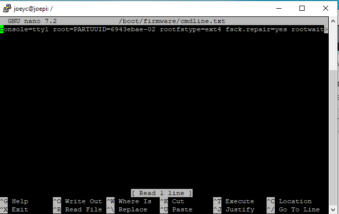
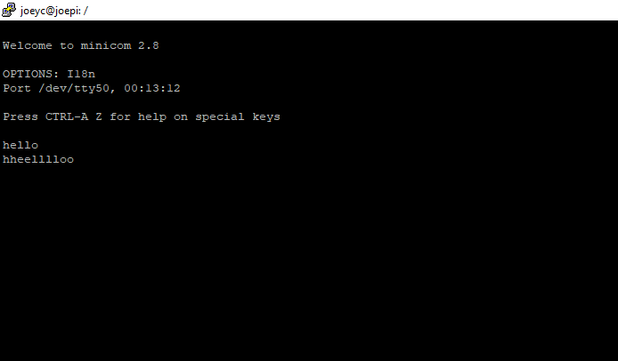
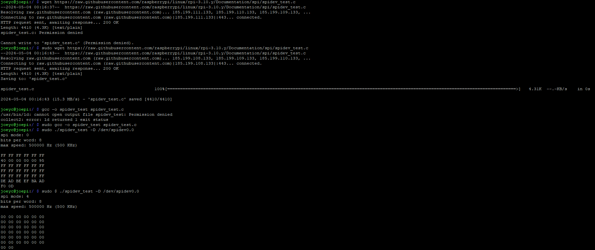
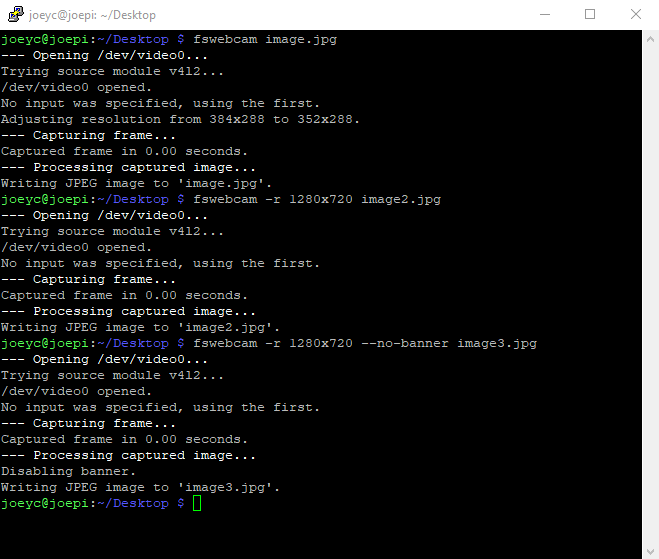
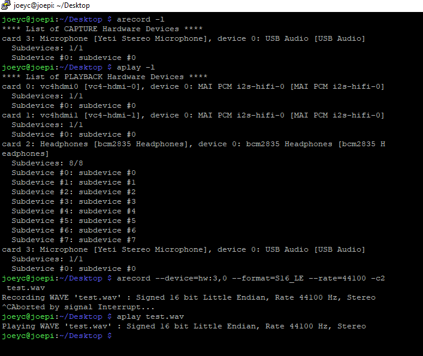

# Lab 2A GPIO and Serial Communication

Note* the original command was actually in boot/firmware and not just boot. And the text I was supposed to delete did not exist within the file. 

  

For the command `minicom -b 115200 -o -D /dev/ttyS0`, I had to put sudo in front of it in my ssh for it to run, meaning my ssh does not have * permissions in my device. 

  

#Lab 2B SPI  

Spidev Test:  

  

Labs 2C - 2F I do not own a breadboard and cannot complete those tests in time  

# Lab 2G USB Webcam  
Below is the command line of the pictures being taken from a webcam  

  

# Lab 2H USB Mic and 3.5mm Headphones
 
The initial command `$ arecord --device=hw:3,0 --format S16_LE --rate 44100 -c1 test.wav` did not work (my microphone was on channel 3), so I had to modify it to this to get it to work: 
`arecord --device=hw:3,0 --format=S16_LE --rate=44100 -c2 test.wav
`  

  

