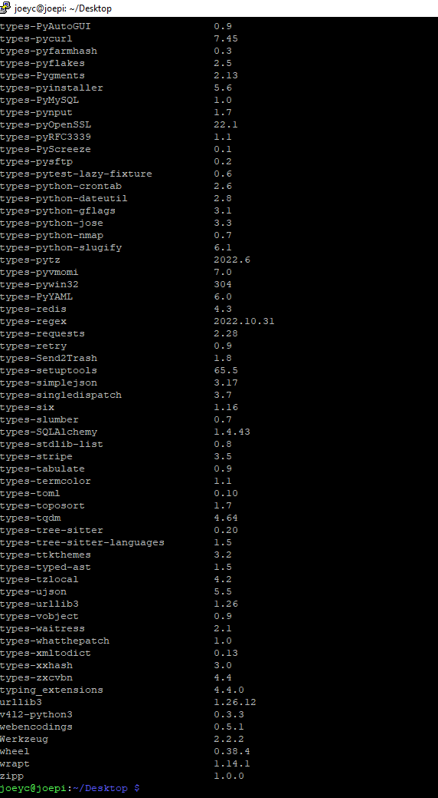
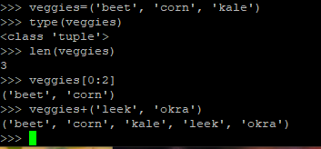
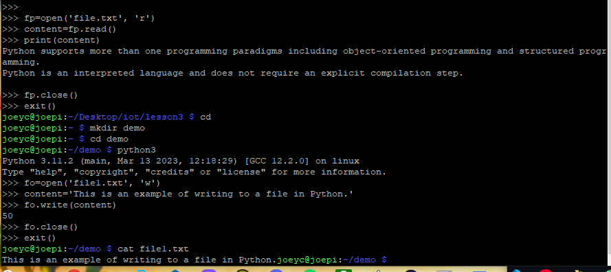

# Lab 3A Python

In this lab we played with the basics of Python on a Raspberry Pi.  

Below are the initial commands to make sure Python3 is installed

  

  

## Numbers: int, float, and complex

  

## Strings: text and binary data

  

## Tuples  

  

## Lists

  

## Dictionaries

  

 
## If else

  

## If not

  

## For

  

## While

  

## Break

  

## Continue (or pass)

  

## Mathematical functions

  

## Built-in functions

  

## Defining functions

  

## Keyword arguments

  

## Variable-length arguments

  

## Modules

  

## Read and write files

  

## Socket Server

  

Labs 3B through 3D require a breadboard and I do not have one

# Lab 3E: PyPy

  

# Lab 3F: Doxygen

  

