# Lab 4A and 4B - Django and Flask

Lab 4 aims to teach the basics of Django and Flask web frameworks for Python.

## Stevens Project  

After installing the necessary packages and starting the stevens project below is what setting up the database on the raspberry pi looks like:

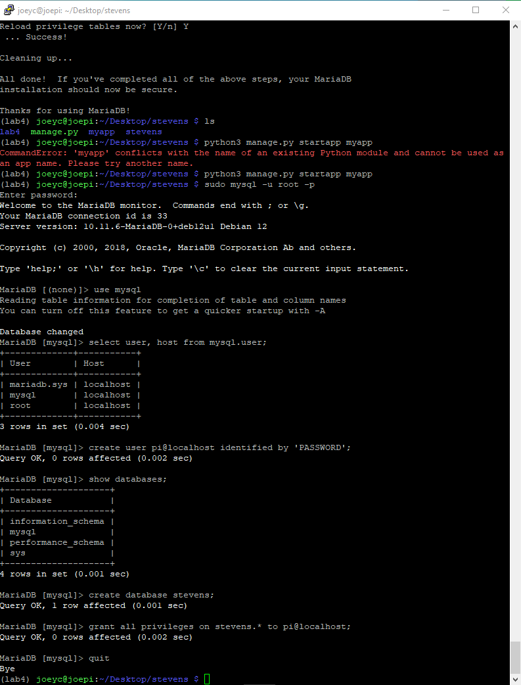  

Below shows that the Django server is running correctly

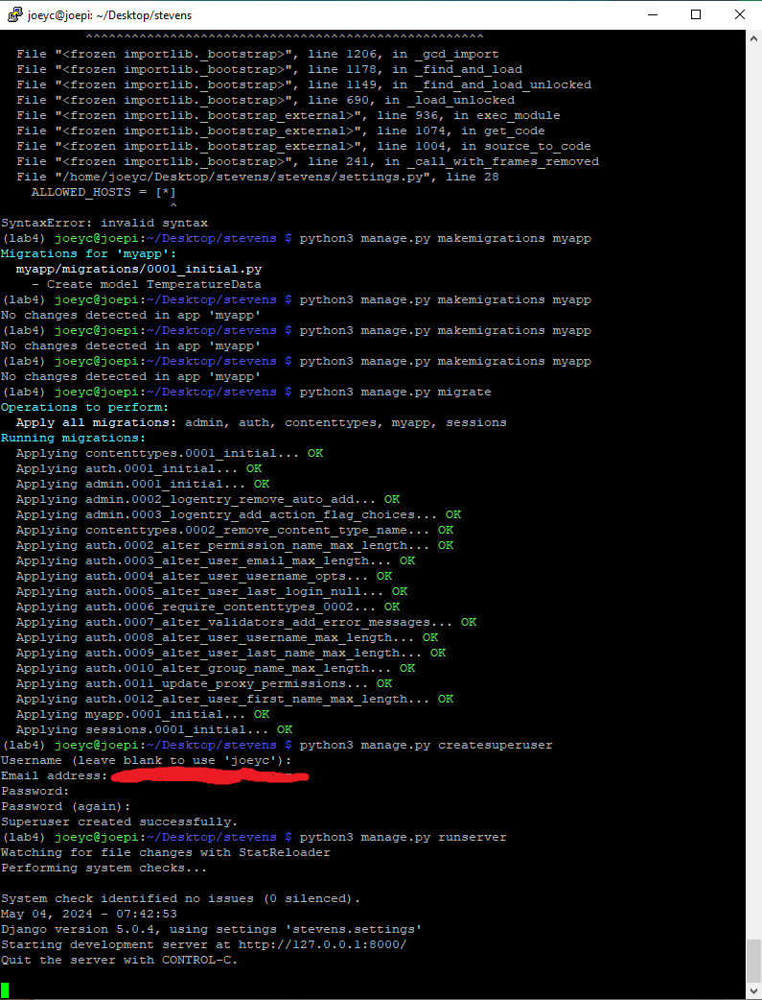  

Here is a screenshot of the VNC where I connected to the server and see the admin page

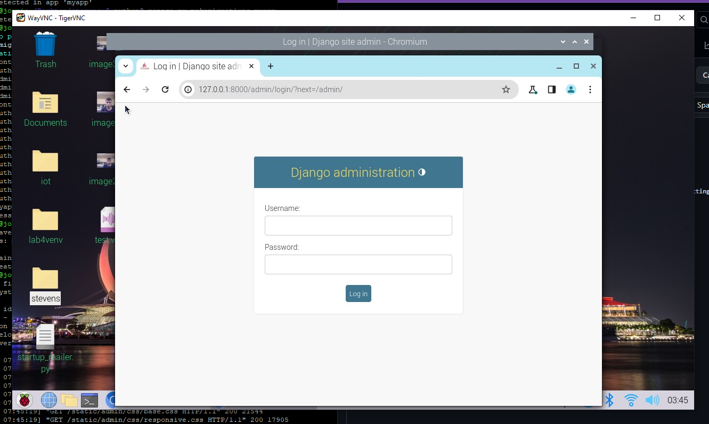  

Screenshot of the added temperature data in Hoboken

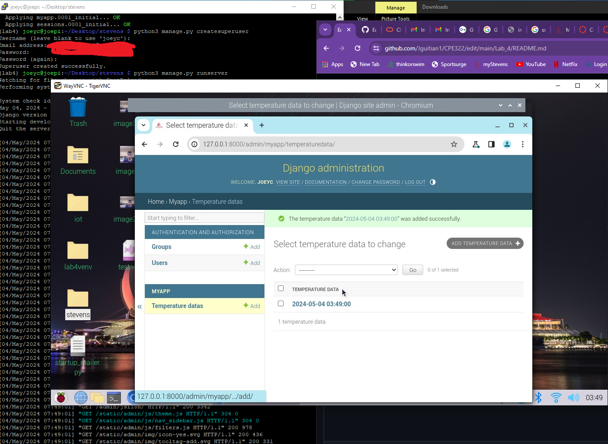  

Here is a screenshot from my desktop going to the other server with the Google Maps API. I did not want to put my credit card into Google to access the API key

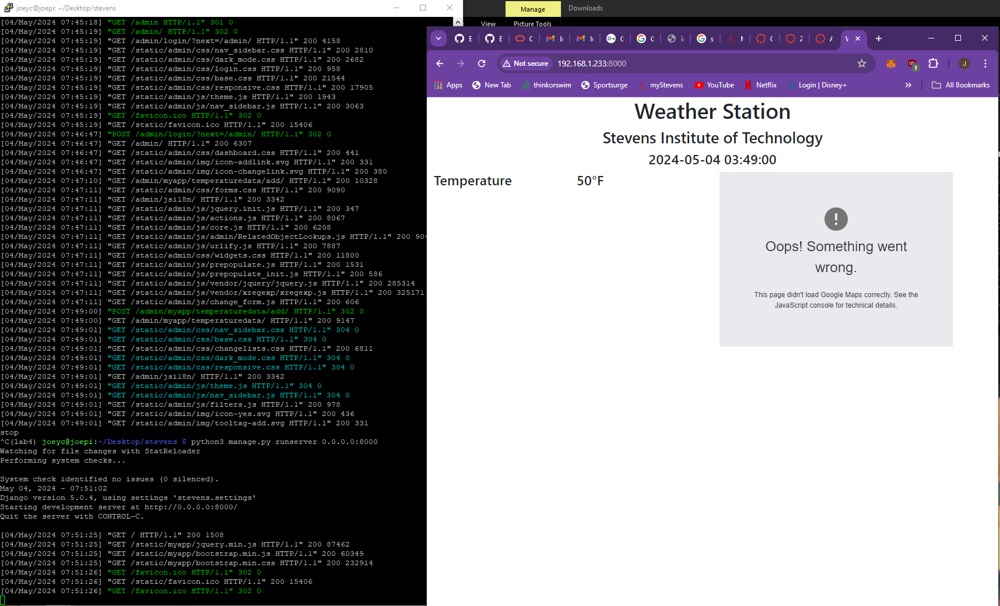  

## MyCPU Project

Below I created the project and added myapp folder

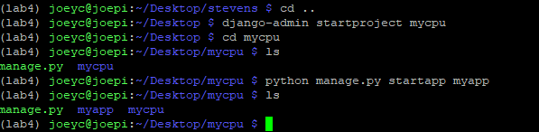  

Here is the completed setup of the server and the admin login page

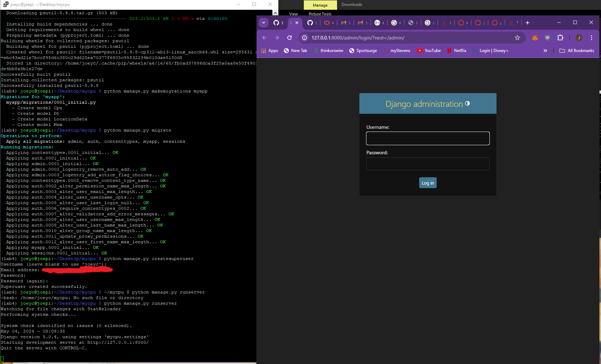  

The next four images are me logging into admin and posting the location data, and the forms on the Dt, CPU, and Mem lists.

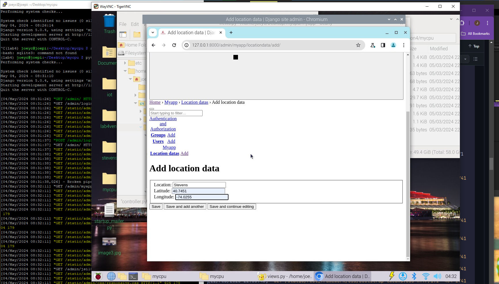  

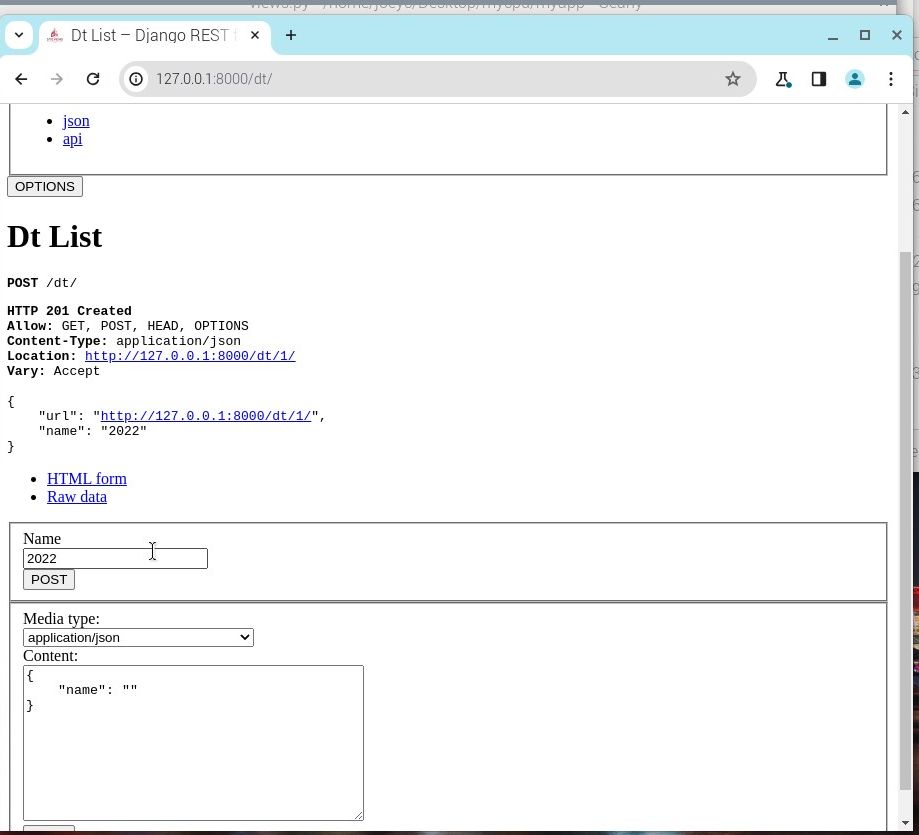  

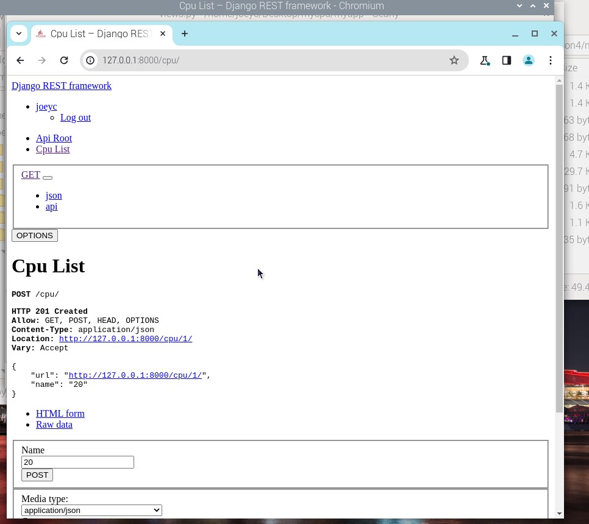  

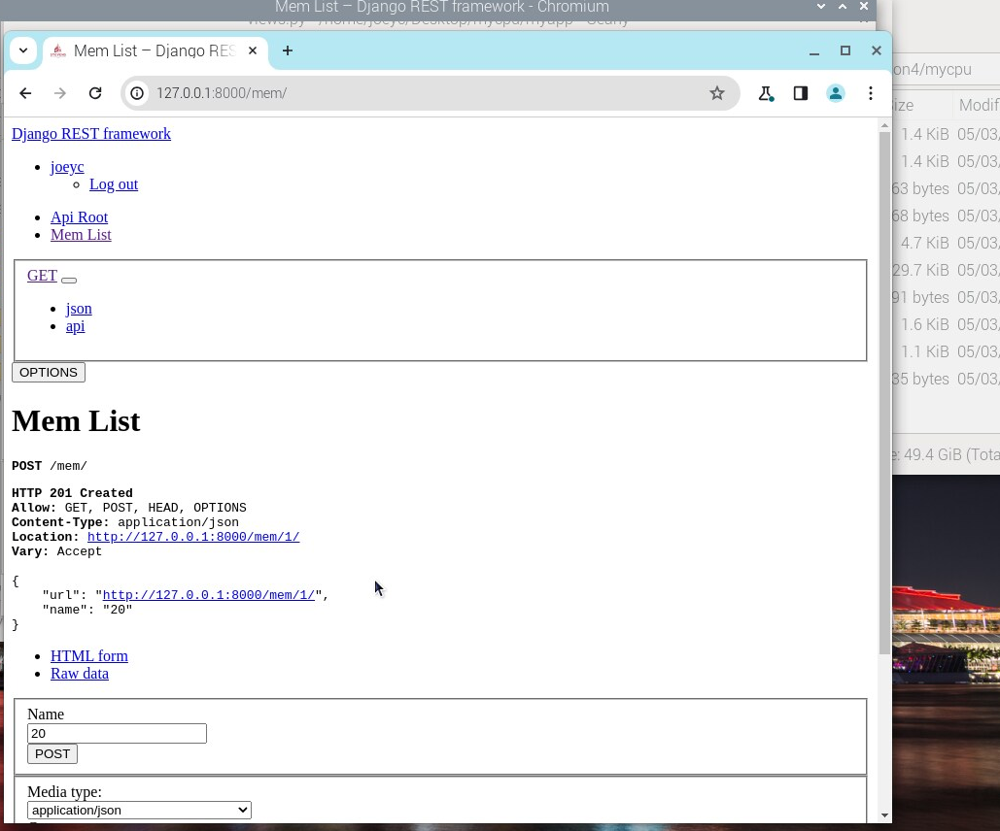  

Lastly for this project, below is me connecting to the server from another client

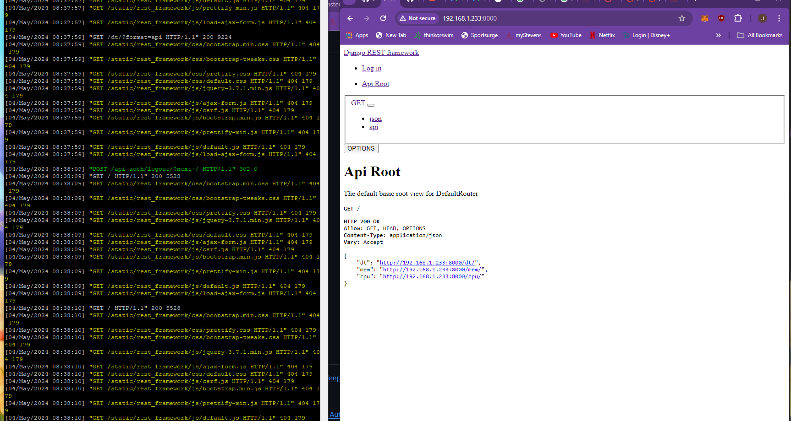  

# Lab 4C: Flask

Flask Hello_World.py

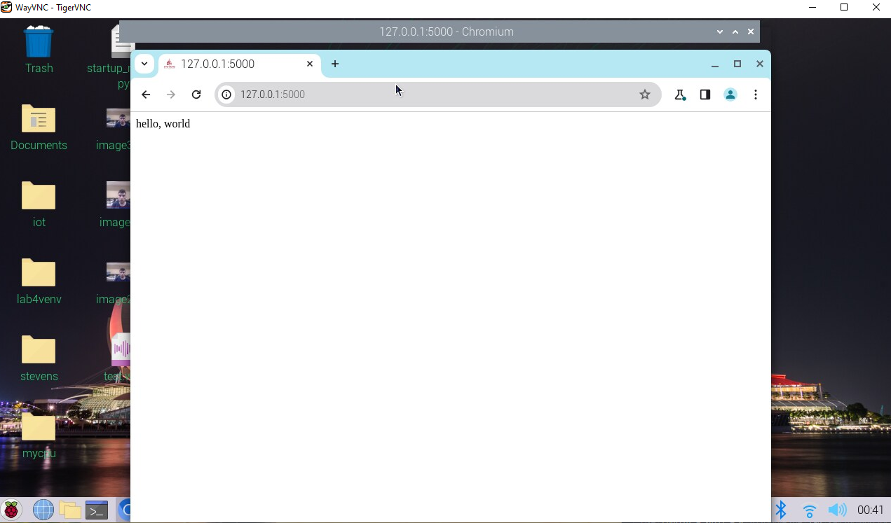  

