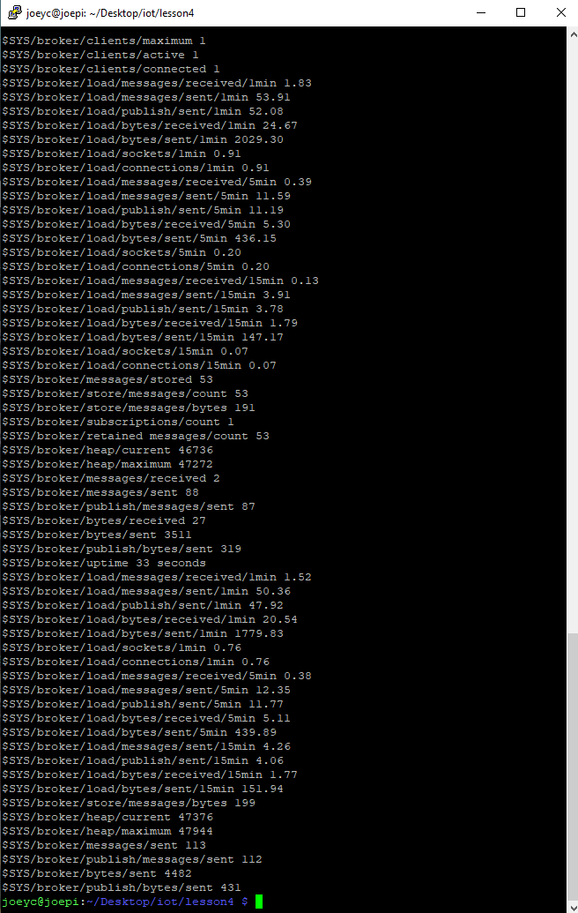
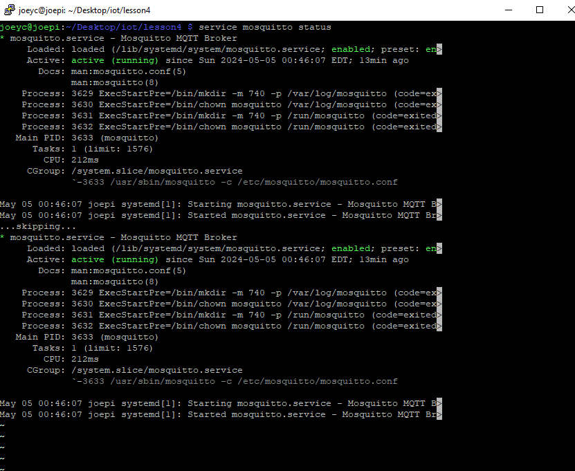
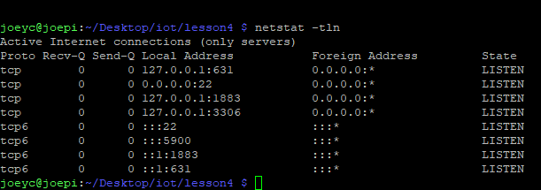
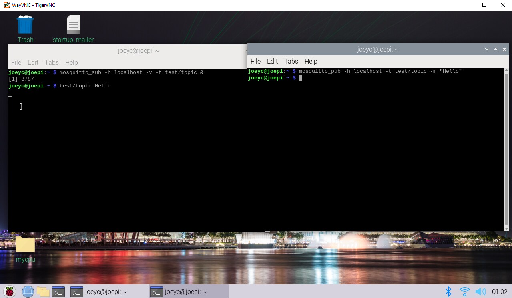
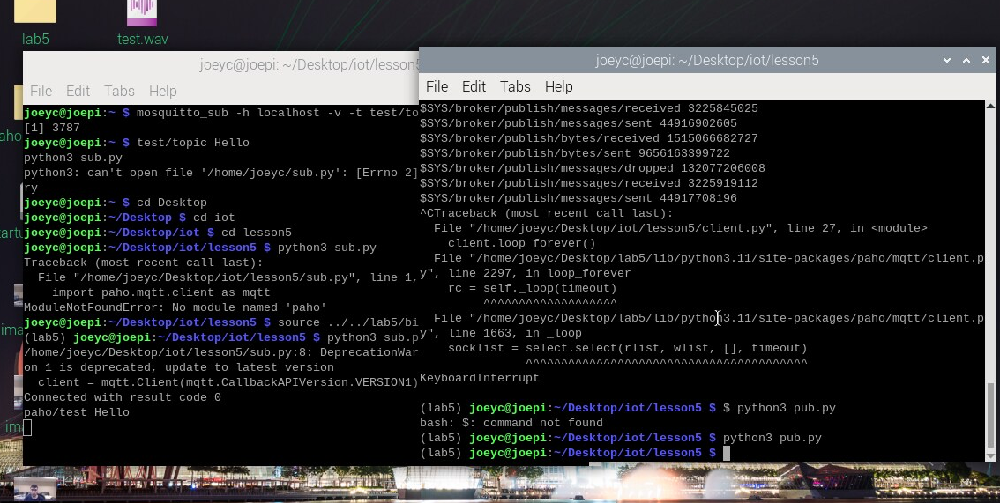
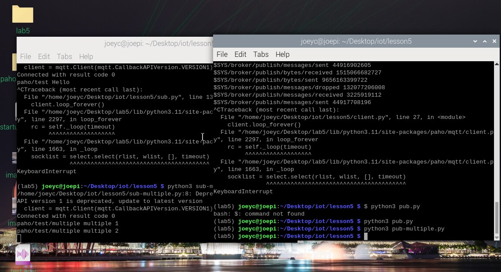
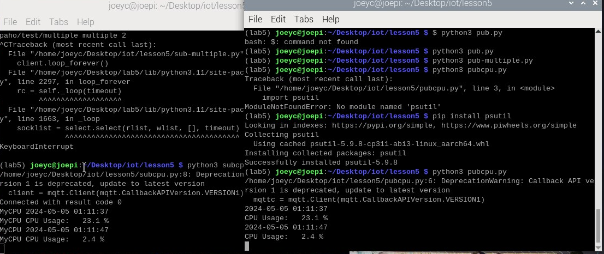
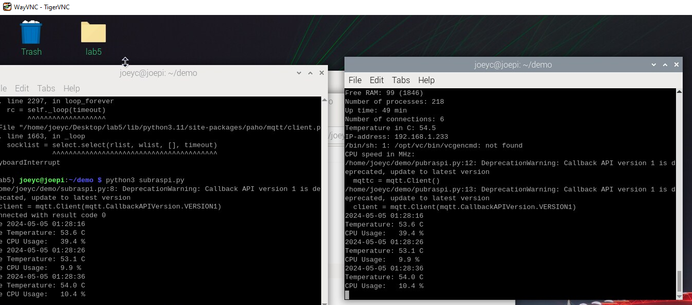

# Lab 5A: Eclipse Mosquitto and Eclipse Paho

Subscribing on one terminal and publishing to another:

  

Mosquitto status and netstat command

  

  

Image of both terminals speaking to each other

  

Sub.py and Pub.py:

  

Sub-multiple.py and Pub-multiple.py:

  

Subcpu.py and Pubcpu.py

  

For subraspi and pubraspi, I had to change some things around to get this code to work. Firstly the default path was `/opt/vc/bin/vcgencmd`, but I had to change it to `/usr/bin/vcgencmd`, which was the opposite of what was written in the lab. I am on a newer version but the default was for older versions of the Raspberry Pi OS. Secondly, I had to uncomment out this line here: 
`mqttc = mqtt.Client()`, because I got an error saying it did not know what mqttc was. This was done in pubraspi.py and then it was able to connect to the other terminal.

  
