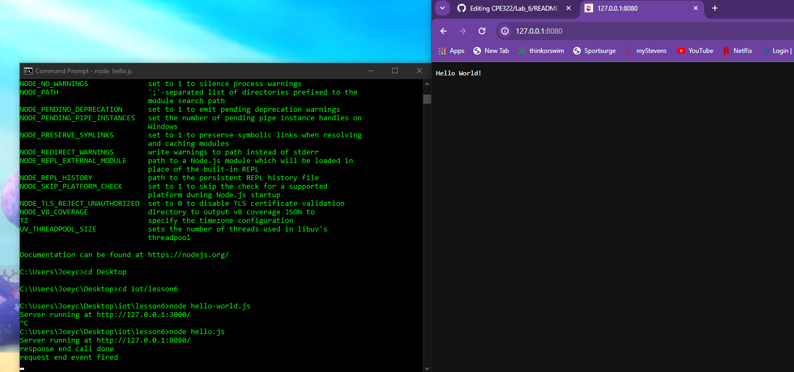

# Lab 6A: Node.js

In this lab we learn about the basics of Node.js and other alternative devices

Hello-world.js:

The server started on port 3000 for me instead of port 8080

  

Hello.js:

This file ran at port 8080

  

Http.js:

As you refresh the page the server logs the number of times you refreshed

  

Hello.js on Raspberry Pi:

  

Http.js on Raspberry Pi:

  

# Lab 6B: Pystache

Pystache example code:

  

