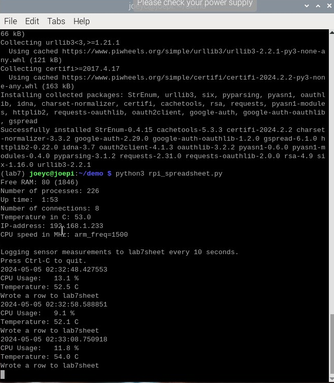

# Lab 7A: ThingSpeak

After signing up and going through all of the steps below are the images of what happened during the process:

  

  

  

  

# Lab 7B: Google Sheets

After going through the process of getting the API key, below are the images representing the console running the python file and the sheet that it is writing to:

  

  
