# Lab 8A: Examples

Below is an image of me shelling into my Raspberry Pi using GitBash:

  

## X applications

### Ico

  

### oclock

  

### xcalc
  

### xclock
  

### xeyes
  

### xgc
  

### xlogo
  

### xman
  

## Numpy Array

  
  

## Review and Run Python Code

### pyplot_simple.py
  

### simple_plot.py
  

### pyplot_formatstr.py
  

### ticklabels_demo_rotation.py
  

### pyplot_three.py
  

### pyplot_two_subplots.py
  

### pyplot_scales.py
For this file, I recieved an error, likely due to depreciation. I had to change `linthreshy` to `linthresh` and then it worked.
  

### pyplot_annotate.py
  

### pyplot_major_minor_demo1.py
  

### legend_demo.py
  

## Histograms, box plots, regression, and interpolation

### Scatter_demo.py
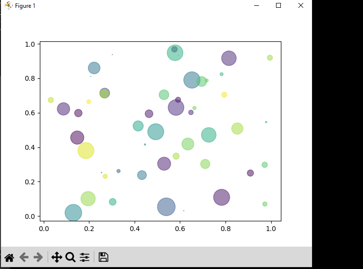  

### Histogram_demo_features.py
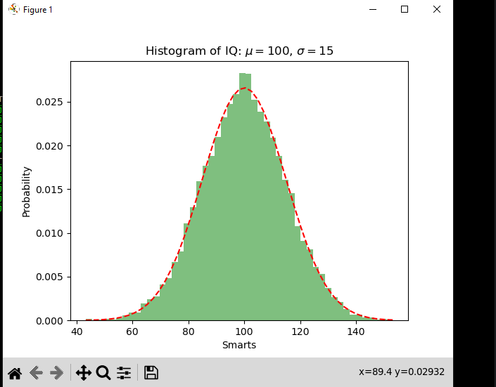  

### pyplot_text.py
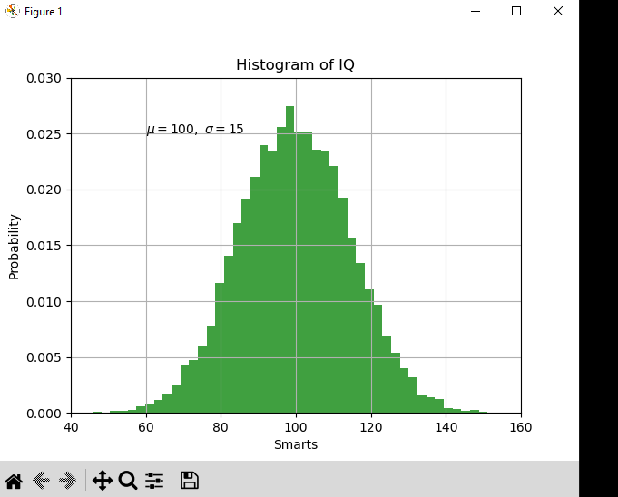  

### histogram_demo_extended.py
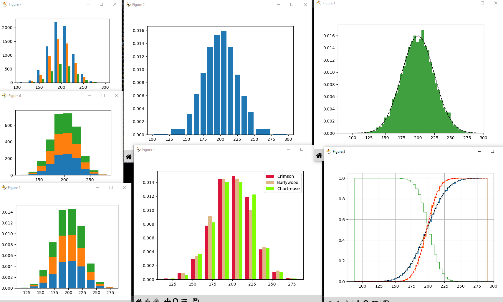  

### boxplot_demo.py
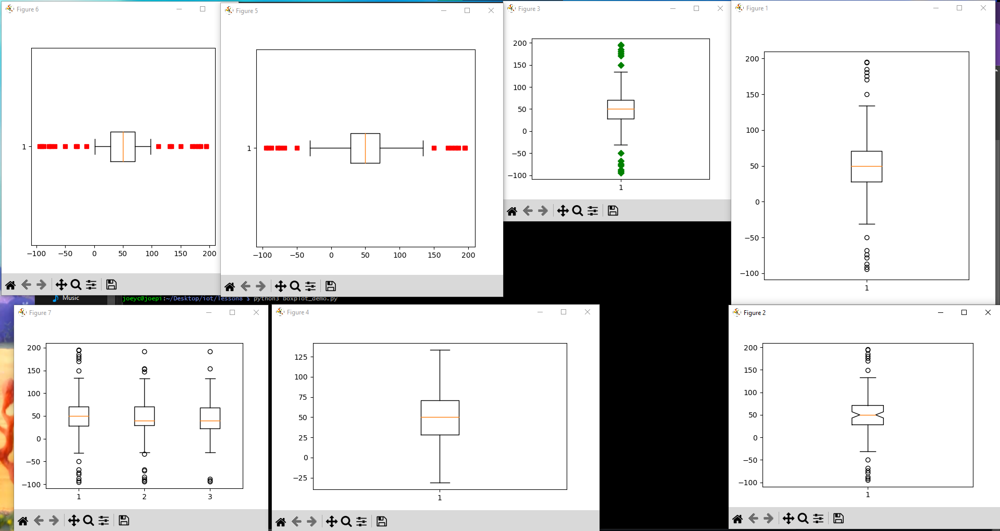  

### linreg.py
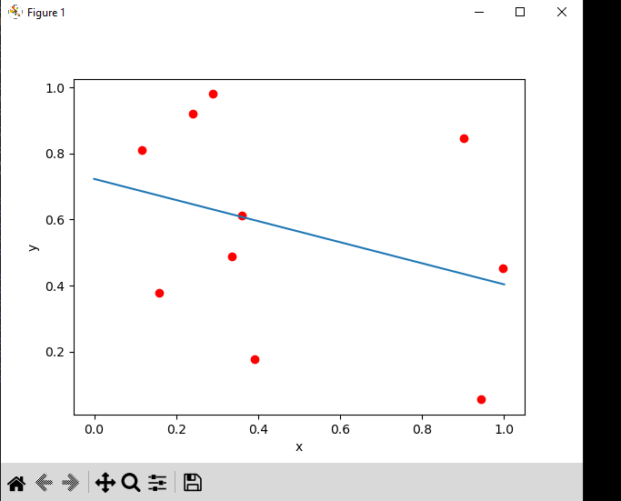  

### interpolation.py
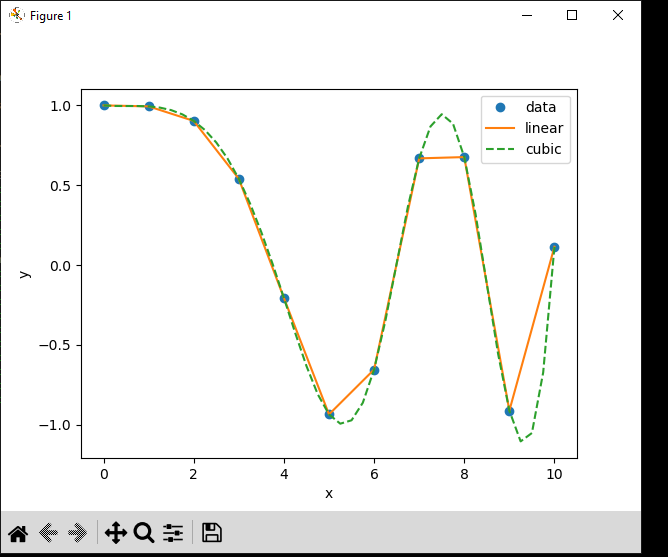  

## Classification, cross-validation (CV), and support-vector machine (SVM)

### plot_lda.py
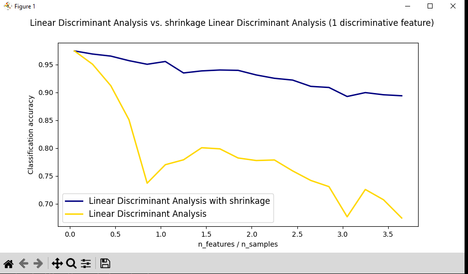  

### plot_lda_qda.py
Had to correct ellipse arguments here: 
`angle = np.arctan2(u[1], u[0])  # using arctan2 instead of arctan
    angle = np.degrees(angle)  # converting radians to degrees
    ell = mpl.patches.Ellipse(mean, 2 * np.sqrt(v[0]), 2 * np.sqrt(v[1]),
                              angle, color=color, edgecolor='yellow', linewidth=2, zorder=2)`
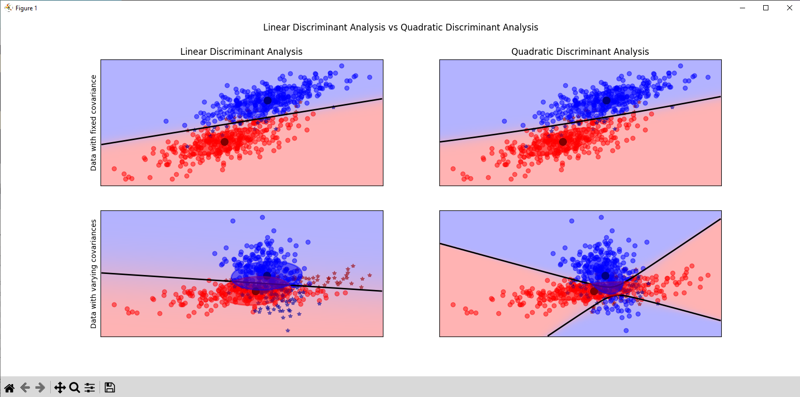  

### plot_cv_predict.py
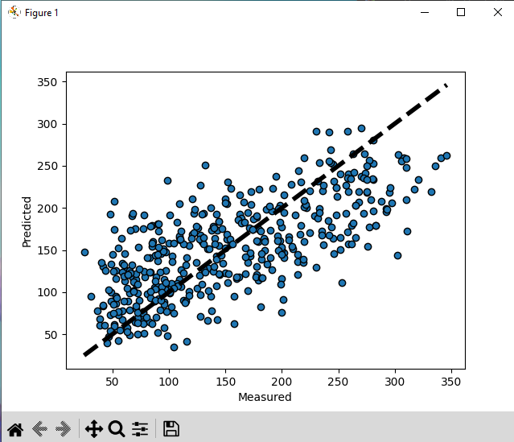  

### plot_cv_diabetes.py
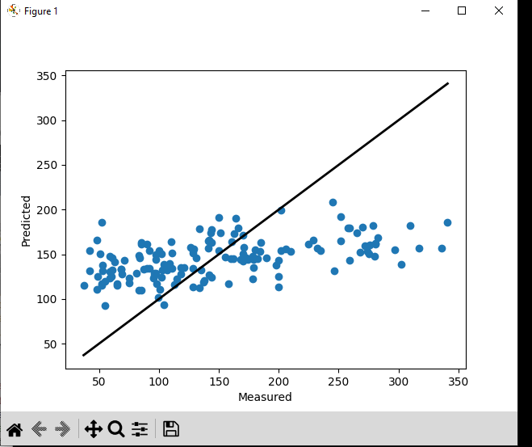  

### traffic.py
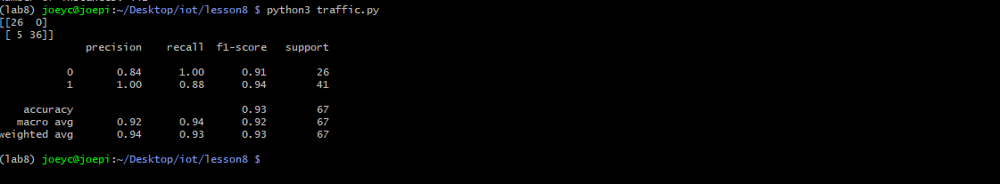  

## Keras and TensorFlow

### keras_diabetes.py
Here I had to set the envirnment variable `PYTHONENCODING` to this: `PYTHONIOENCODING=utf-8`
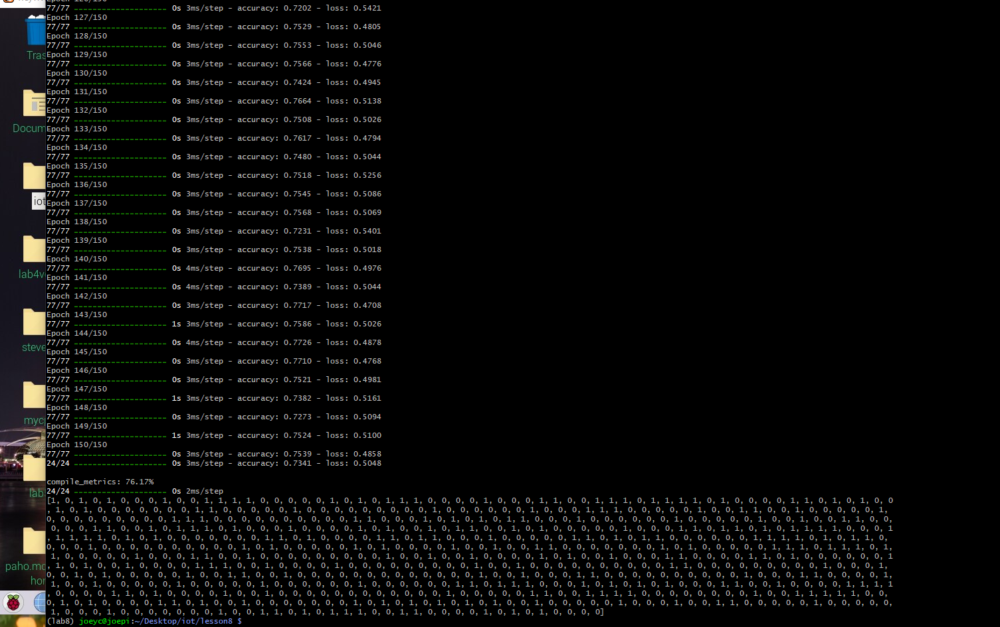  

### keras_first_network.py
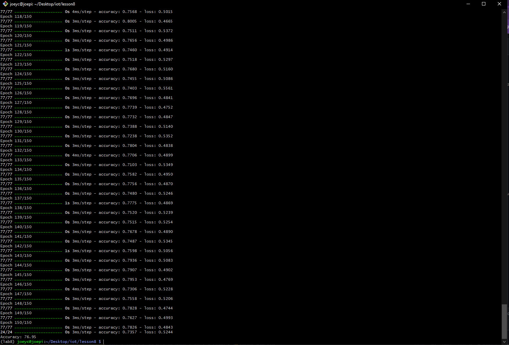  

## Titanic example

### titanic_1.py
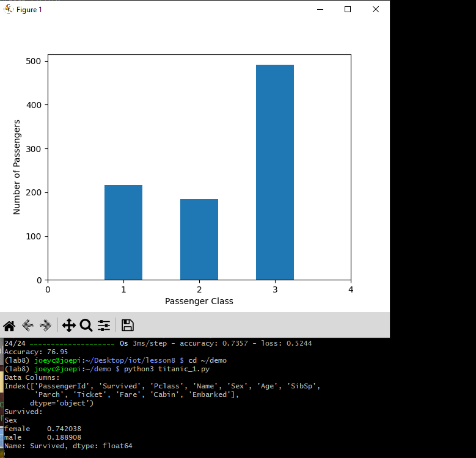  

### titanic_2.py
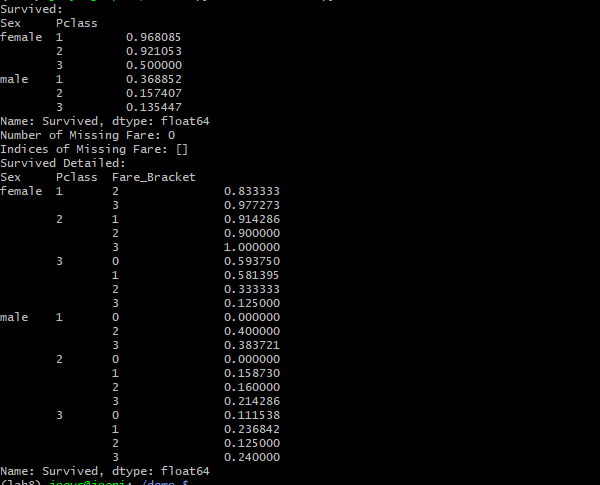  

