# Lab 8A: Examples

Below is an image of me shelling into my Raspberry Pi using GitBash:

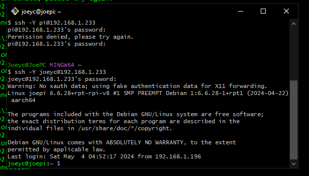  

## X applications

### Ico

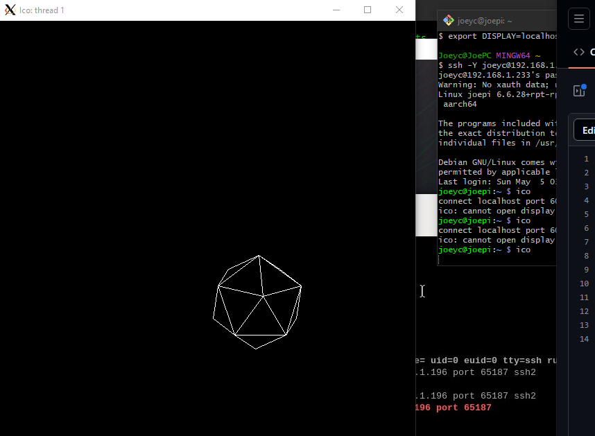  

### oclock

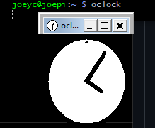  

### xcalc
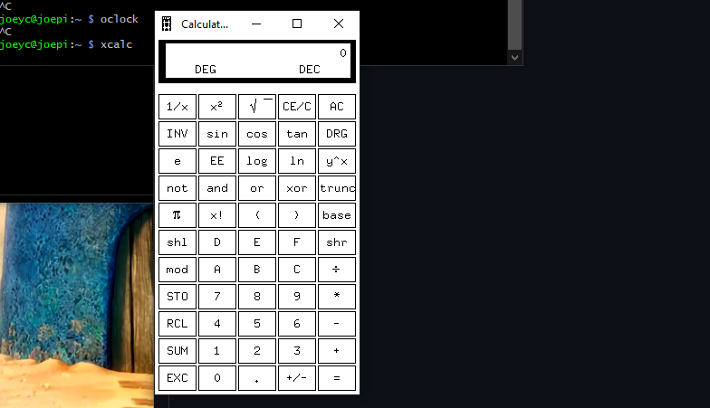  

### xclock
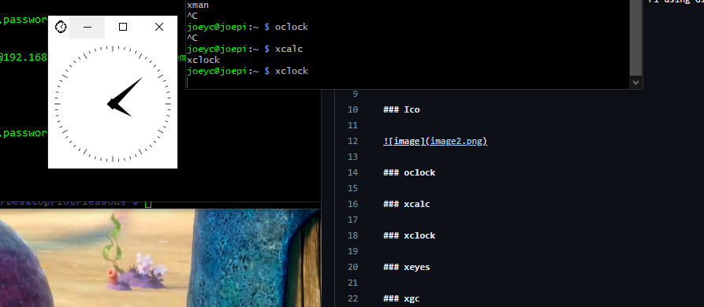  

### xeyes
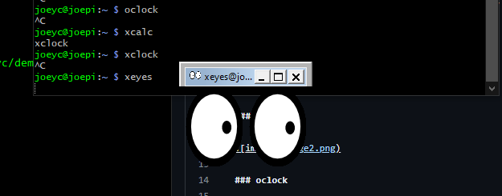  

### xgc
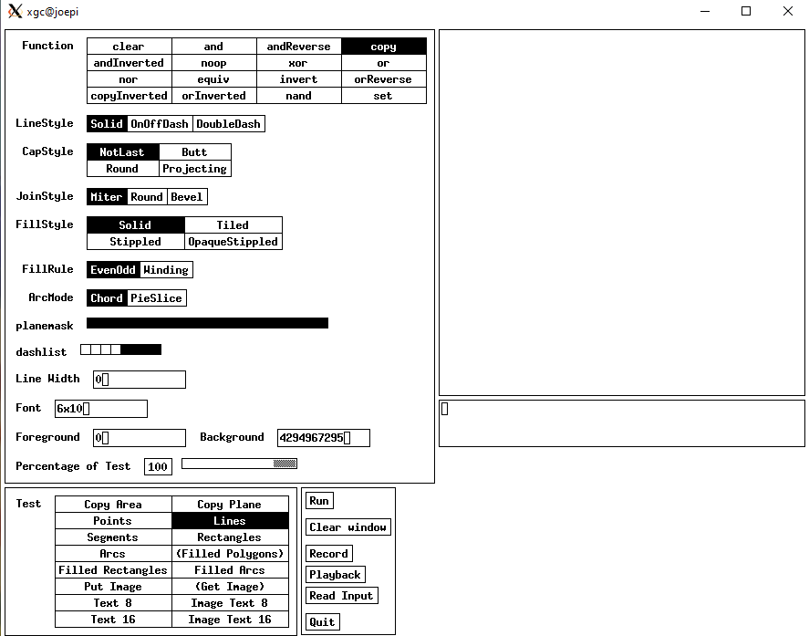  

### xlogo
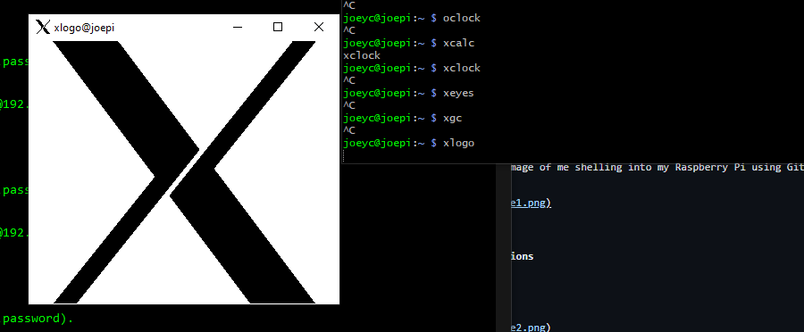  

### xman
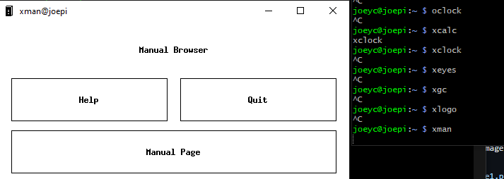  

## Numpy Array

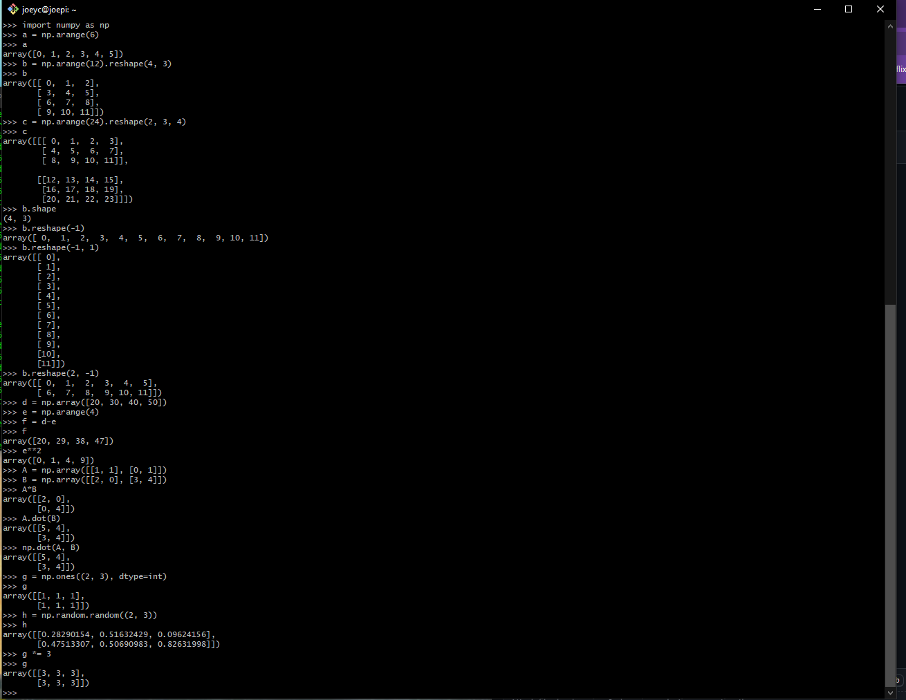  
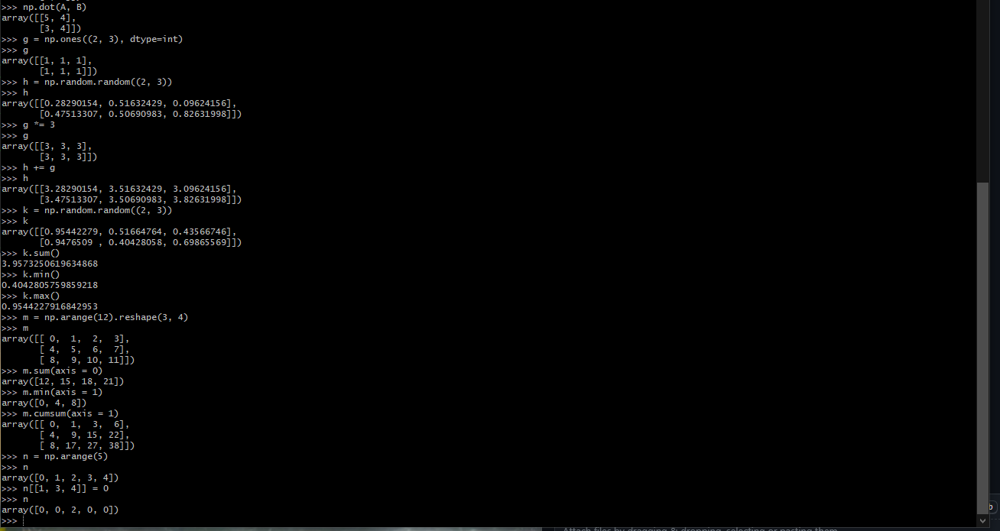  

## Review and Run Python Code

### pyplot_simple.py
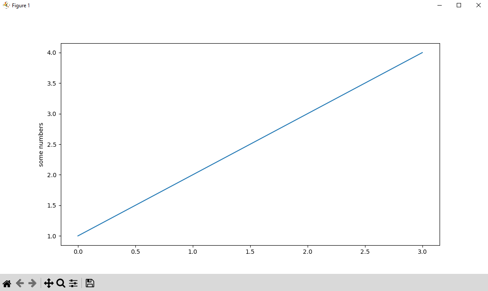  

### simple_plot.py
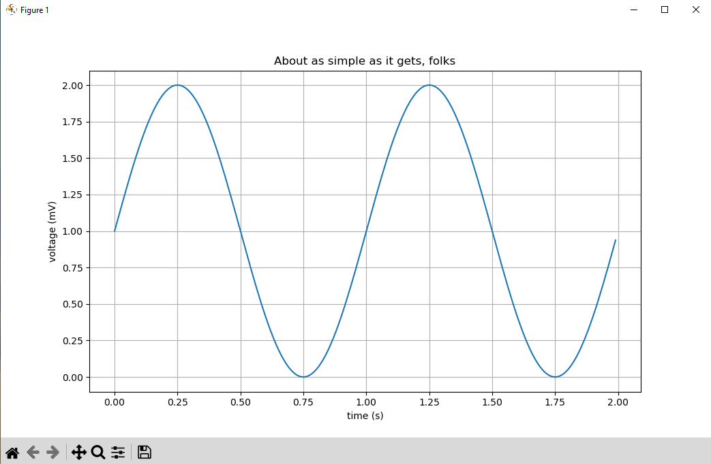  

### pyplot_formatstr.py
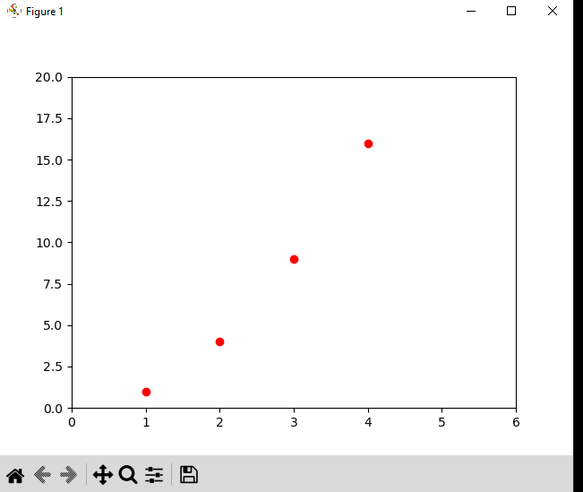  

### ticklabels_demo_rotation.py
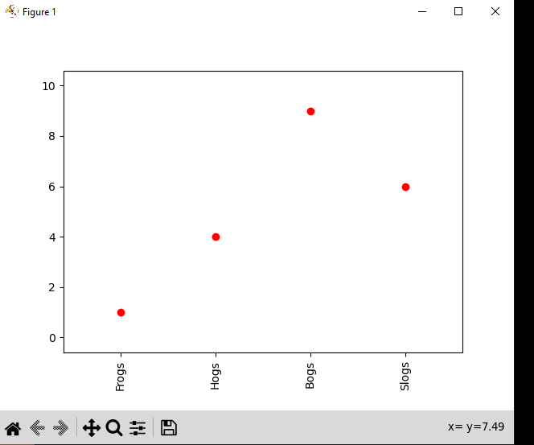  

### pyplot_three.py
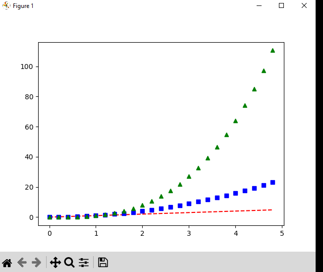  

### pyplot_two_subplots.py
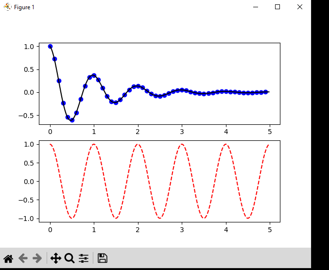  

### pyplot_scales.py
For this file, I recieved an error, likely due to depreciation. I had to change `linthreshy` to `linthresh` and then it worked.
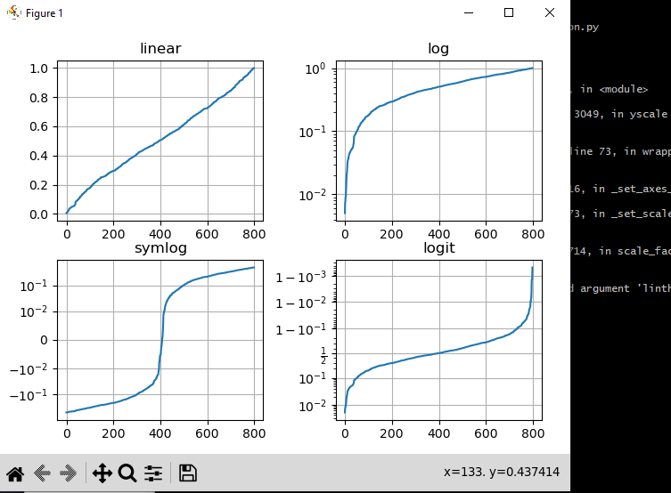  

### pyplot_annotate.py
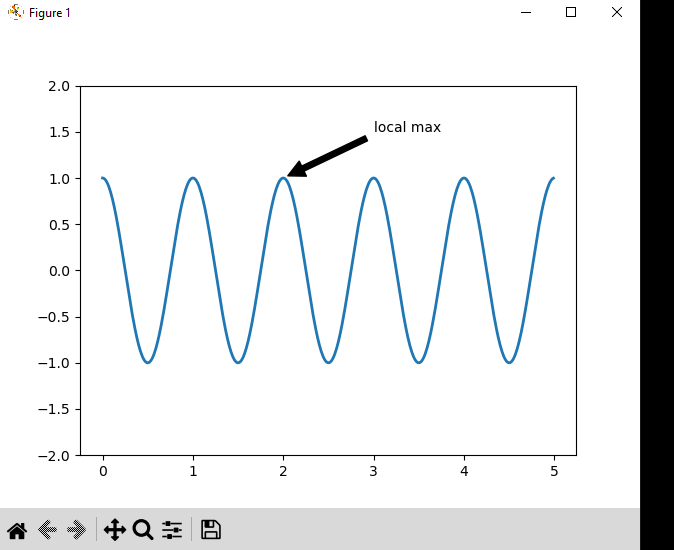  

### pyplot_major_minor_demo1.py
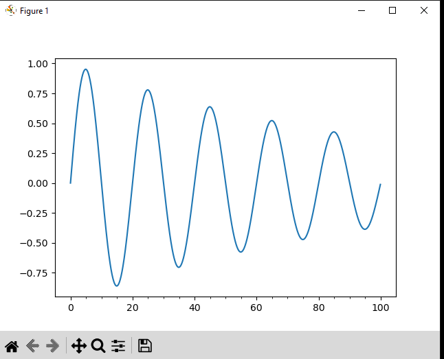  

### legend_demo.py
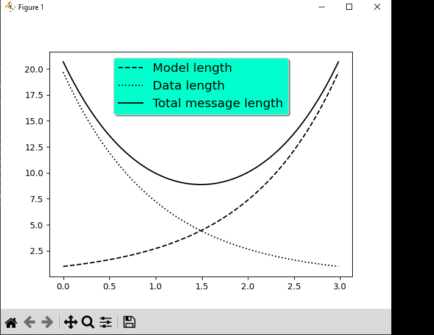  

## Histograms, box plots, regression, and interpolation

