# Lab 9A: YANG

## Ubuntu Installation on WIndows 10

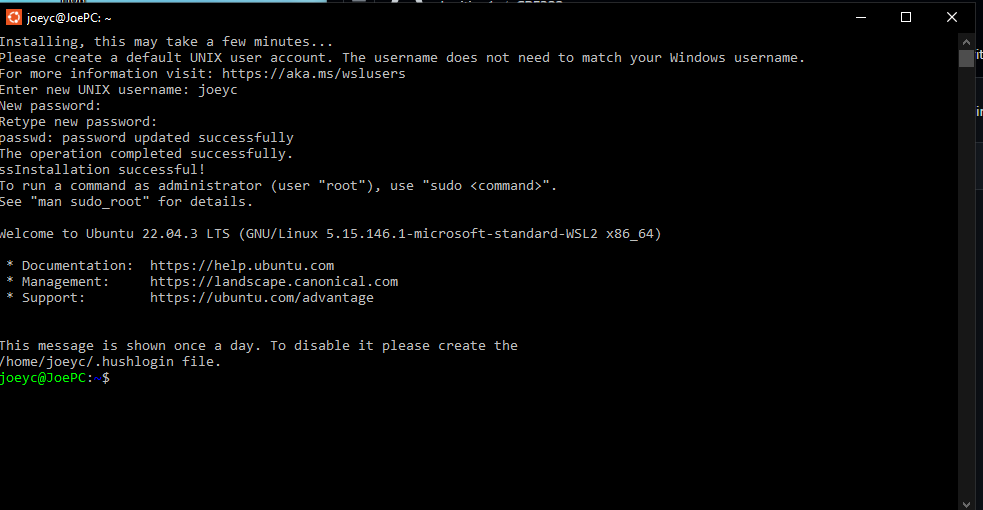

### intrusiondetection.yang

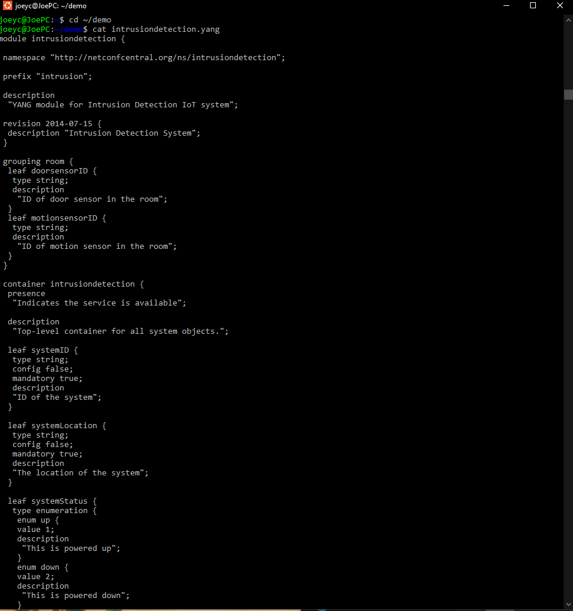
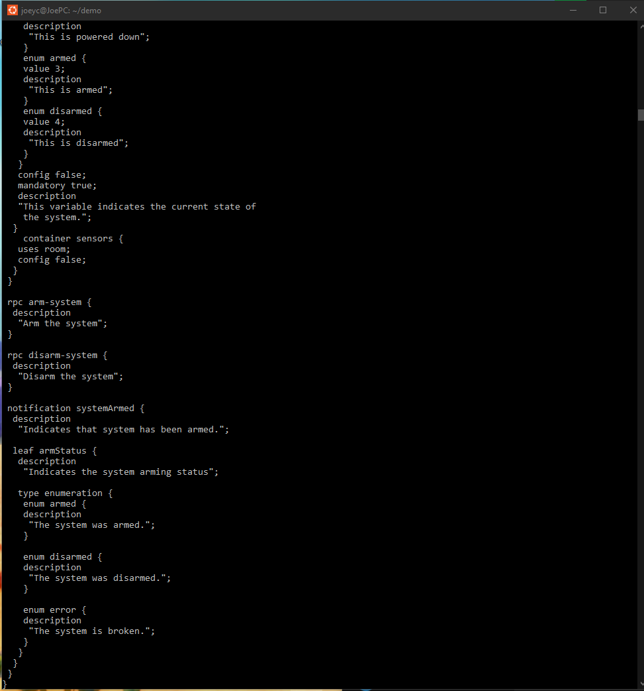

### cat intrusiondetection.yin
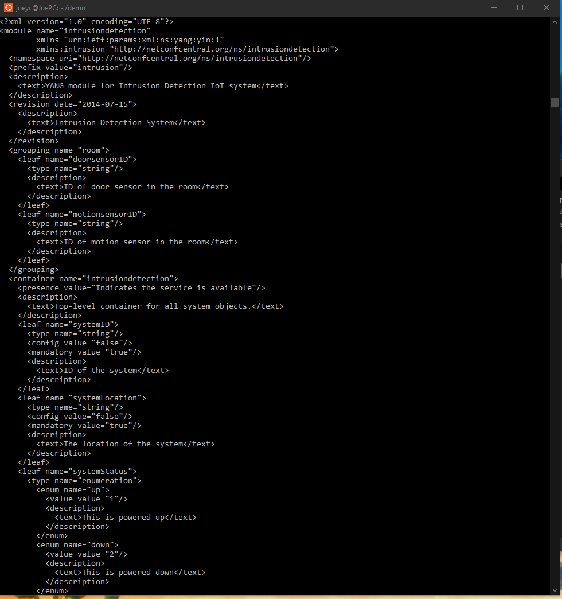
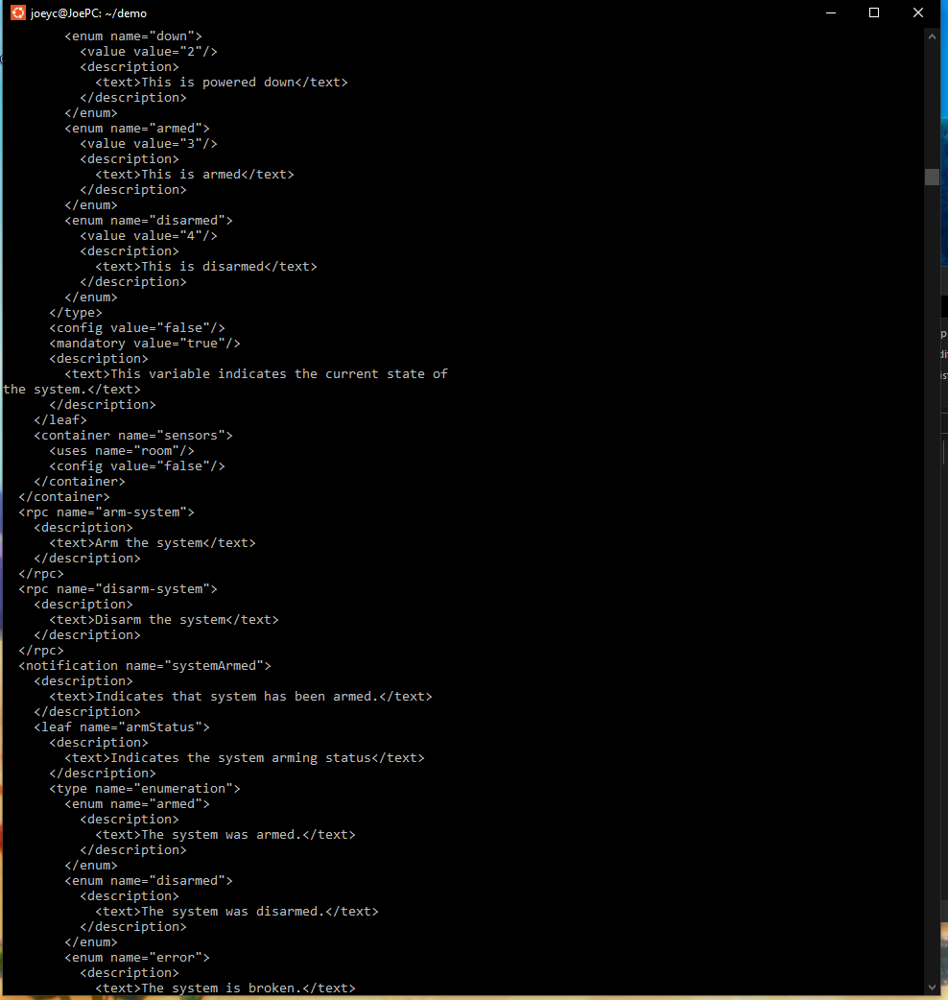

### cat intrusiondetection.uml
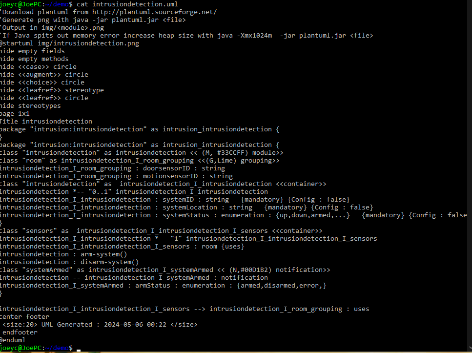

### python3 -m plantuml intrusiondetection.uml
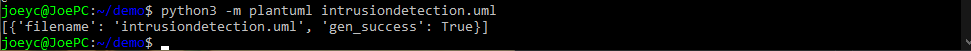

## Pyang install on Raspberry Pi

### intrusiondetection.yang
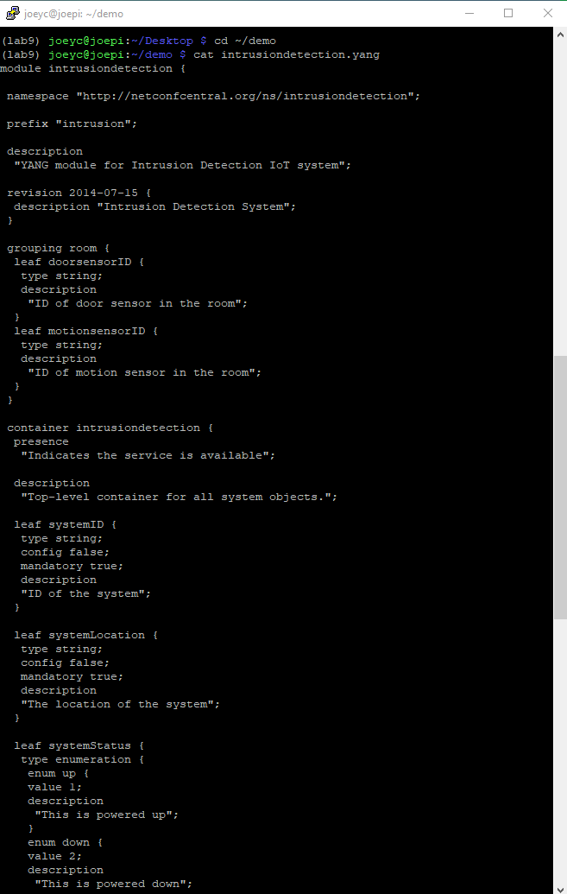

### cat intrusiondetection.yin
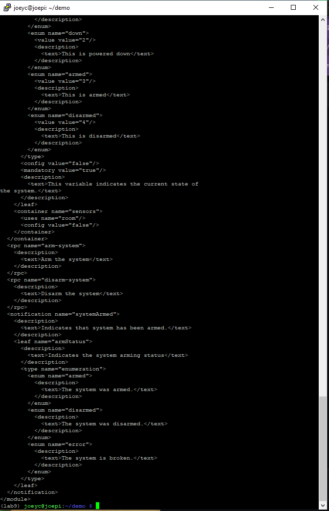

### cat intrusiondetection.uml

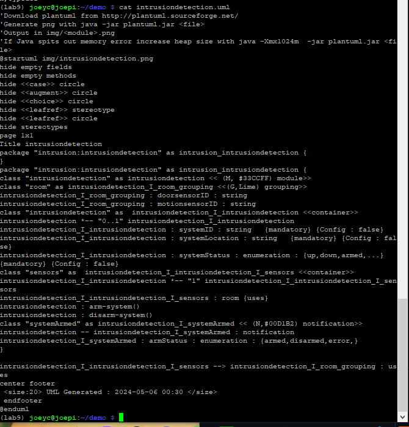

### python3 -m plantuml intrusiondetection.uml

Had to also pip install 'six' to run

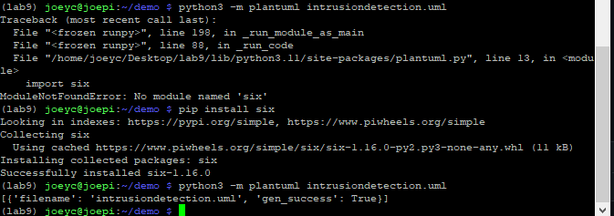

### Display png via GIMP and Pinta

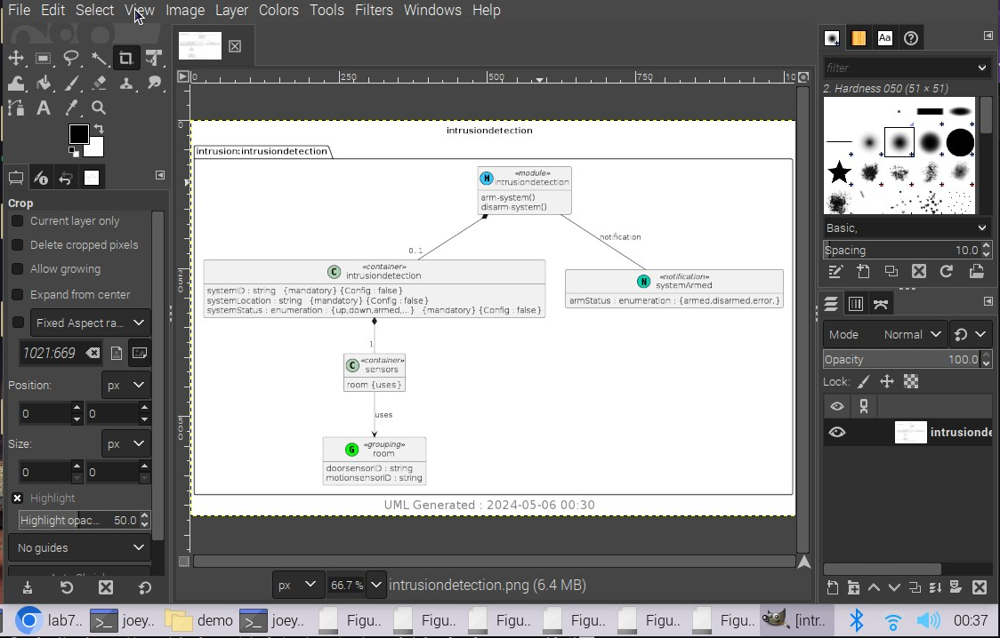

