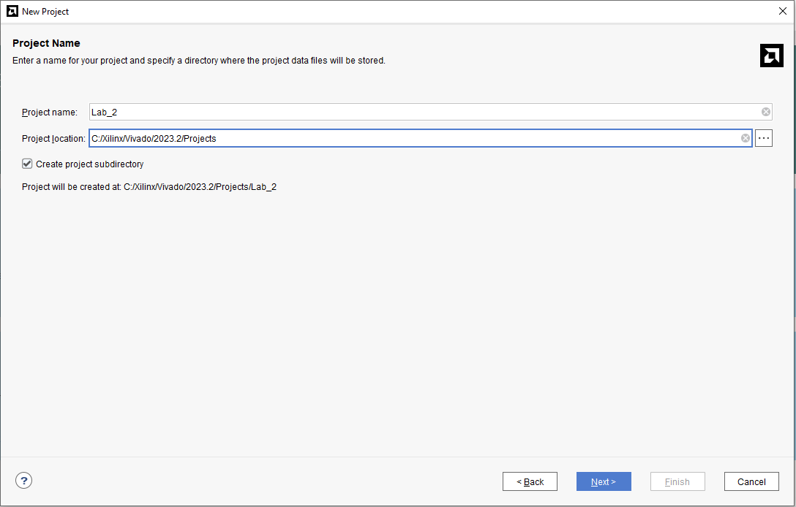
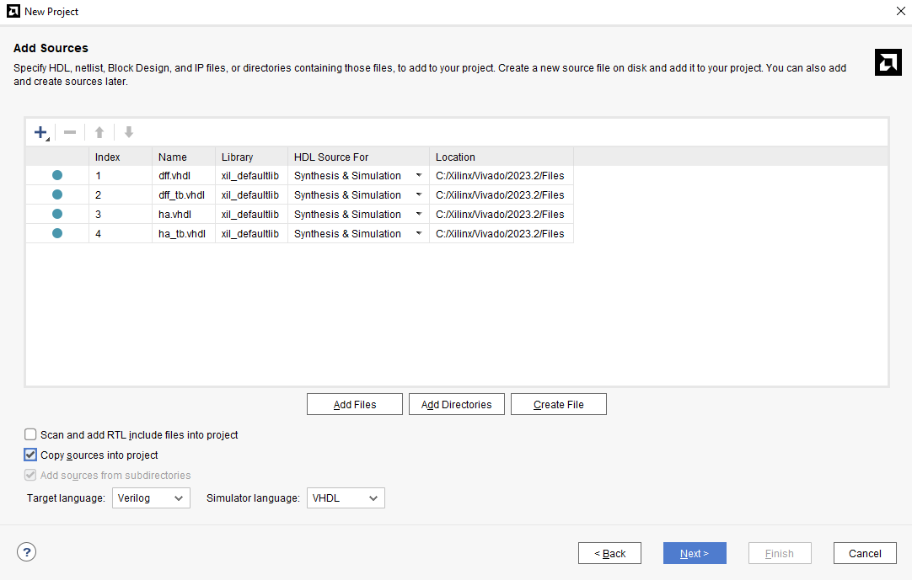
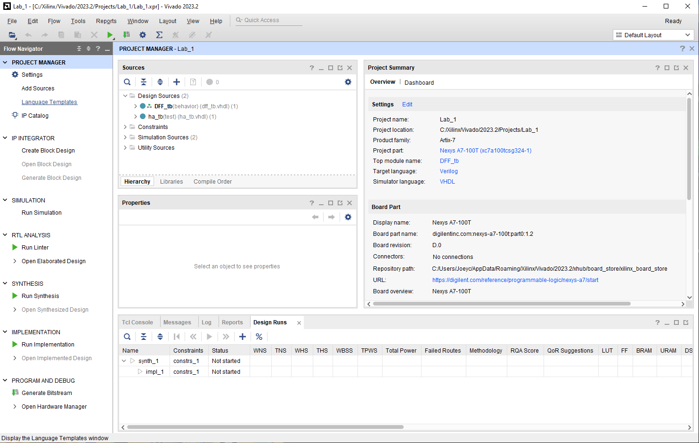
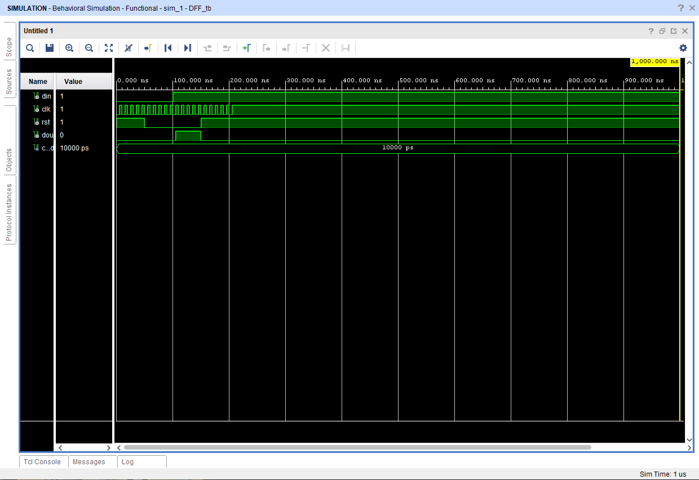

# Lab 01 - GHDL and GTKWave

This lab requires you to install GHDL and to learn how to run files and view their waveform outputs

## Installation and Setup  

Instead of downloading GTKWave, I used software that I already used to run and create GHDL programs called Vivado. After opening the application I selected Create a New Vivado Project  

The project then asks for you to name it and decide which directory to place it in. I made a new folder in the path below called "Projects" to store all of my projects in the same place  

  

After initiating the project I selected the necessary files as my sources. This particular project had no constraint files  

  

## Simulations

Below is what Vivado looks like once the project has been fully initiated. Within the sources window you can edit the code in your source files  

  

The first simulation I did was for the D Flip-Flop, which looked exactly like the example lab's but the only difference was the order of the waveforms. For example, the clock is on the second row below but was first in the example  

  

Lastly, I ran the half adder simulation

  

