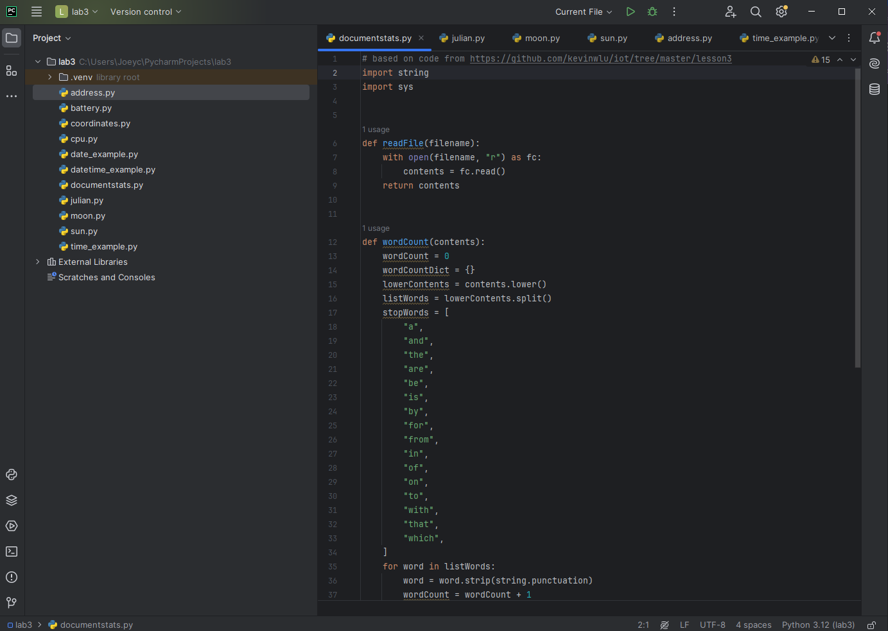
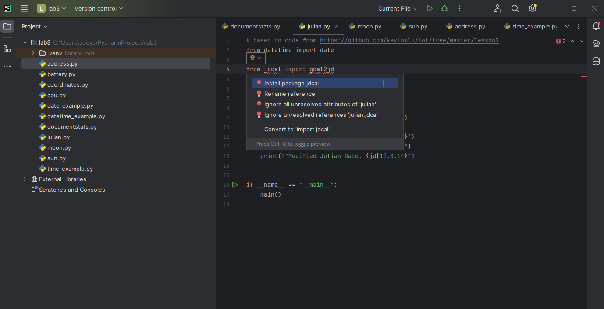
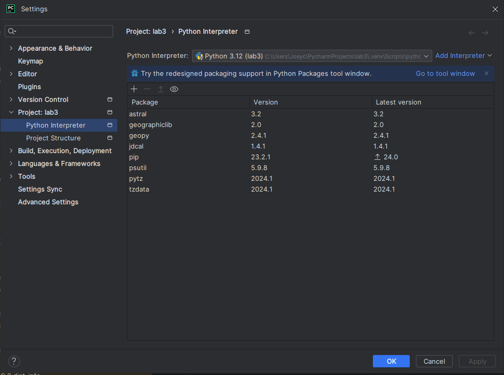
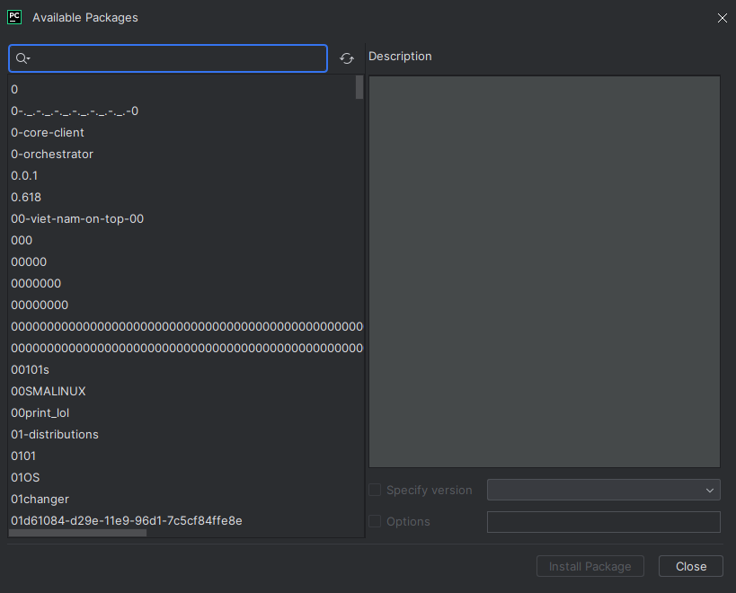
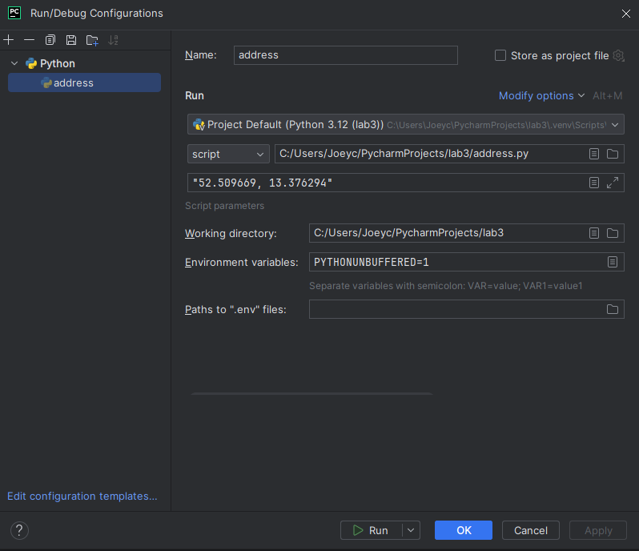

# Lab 03 - Python Basics

Lab 3 asks to go over the basics of Python and to run example scripts and to install some packages  

## Setup  

Instead of using micromamba as a package manager, I use PyCharm. PyCharm has its own built in virtual envirnments for each project that is created, and automatically creates the necessary dependency files to recreate the project. PyCharm also lets you use a built in terminal to run any scripts that may require it.  

Below is what the project looks like after simply placing the required files into the lab  

  

## Installing packages  

In this case, where the files are already made for me, including the imports, I can just hover the cursor over the red line and it will give me the option to install the missing package  



As it is good to know how to use a terminal based package manager, installing packages this way is significantly easier for the sake of running basic Python Scripts. The image below shows where you can locate the packages you already have installed in the project directory

  

If I were to create my own script from scratch and didn't know what packages to install based on the red error lines, I would click on the settings button on the top right of PyCharm, select my project, go to Python Interpreter, and then press the "+" sign and search for the specific package I need. I can also view my installed packages here as well.  

  

  

## Script outputs

Before I can implement my script parameters, in PyCharm I have to go to the dropdown menu of my file and edit them as I would in a console, or else the script will recieve an error that there were no system arguments  

  


### address.py

```auto
C:\Users\Joeyc\PycharmProjects\lab3\.venv\Scripts\python.exe
C:\Users\Joeyc\PycharmProjects\lab3\address.py "52.509669, 13.376294" 
Potsdamer Platz, Tiergarten, Mitte, Berlin, 10785, Deutschland
(52.5098014, 13.375589791291057)

Process finished with exit code 0
```  

### battery.py

I am currently using a desktop, so I do not have a battery  

```auto
C:\Users\Joeyc\PycharmProjects\lab3\.venv\Scripts\python.exe
C:\Users\Joeyc\PycharmProjects\lab3\battery.py 
None

Process finished with exit code 0

```  

### coordinates.py

```auto
C:\Users\Joeyc\PycharmProjects\lab3\.venv\Scripts\python.exe
C:\Users\Joeyc\PycharmProjects\lab3\coordinates.py "Yankee Stadium" 
Yankee Stadium, 1, East 161st Street, Bronx County, The Bronx, City of New York, New York, 10451, United States
(40.82958275, -73.92652118491901)

Process finished with exit code 0

```  

### cpu.py

```auto
C:\Users\Joeyc\PycharmProjects\lab3\.venv\Scripts\python.exe
C:\Users\Joeyc\PycharmProjects\lab3\cpu.py 
The number of physical cores = 8
The number of logical CPUs = 16
The utilization per second as a percentage for each CPU
[22.1, 10.8, 21.5, 7.7, 12.5, 6.2, 17.2, 3.1, 23.4, 10.9, 27.7, 10.9, 14.1, 9.4, 29.7, 3.1]
[29.4, 13.4, 12.5, 3.1, 17.2, 4.7, 10.9, 3.1, 18.8, 14.1, 21.9, 6.2, 18.8, 7.8, 18.8, 4.7]
[23.4, 9.2, 34.4, 6.2, 25.0, 3.1, 15.6, 12.5, 25.0, 18.8, 31.2, 10.9, 18.8, 14.1, 30.8, 12.5]
[22.4, 4.7, 10.9, 1.6, 7.8, 4.7, 10.9, 10.9, 17.2, 15.6, 23.4, 10.9, 18.8, 6.2, 7.8, 6.2]
[19.1, 0.0, 23.4, 0.0, 9.4, 7.8, 9.4, 0.0, 26.6, 16.9, 21.9, 4.7, 7.8, 3.1, 14.1, 0.0]
[25.0, 4.6, 20.3, 9.4, 20.3, 4.7, 10.9, 9.4, 15.6, 20.3, 17.2, 9.4, 17.2, 9.4, 10.9, 12.5]
[19.7, 6.1, 20.3, 1.6, 15.6, 3.1, 1.6, 3.1, 20.3, 26.6, 7.8, 4.7, 6.2, 15.6, 20.3, 1.6]
[24.6, 6.2, 17.2, 0.0, 9.4, 3.1, 4.7, 7.8, 25.0, 10.9, 7.8, 12.5, 14.1, 7.8, 17.2, 4.7]
[23.2, 3.1, 17.2, 3.1, 14.1, 1.6, 10.9, 1.6, 18.8, 18.8, 18.8, 6.2, 15.6, 0.0, 20.3, 4.7]
[13.6, 4.7, 18.8, 3.1, 10.9, 6.2, 6.2, 3.1, 28.1, 23.4, 7.8, 10.9, 10.9, 10.9, 21.5, 9.4]

Process finished with exit code 0

```  

### date_example.py

```auto
C:\Users\Joeyc\PycharmProjects\lab3\.venv\Scripts\python.exe
C:\Users\Joeyc\PycharmProjects\lab3\date_example.py 
Date: 2024-05-03
Date: 05-03-24
Day of Week: Friday
Month: May
Year: 2024
471 days after the first day of classes
-365 days before the last day of classes

Process finished with exit code 0

```  

### datetime_example.py  

Due to depreciatuion, I had to modify two lines here:  
  
print(datetime.datetime.utcnow()) changed to:  
```auto
datetime.datetime.now(datetime.UTC)
```
print(datetime.datetime.utcfromtimestamp(time.time())) changed to:  
```auto
print(datetime.datetime.fromtimestamp(time.time(), datetime.timezone.utc)) 
```

```auto
C:\Users\Joeyc\PycharmProjects\lab3\.venv\Scripts\python.exe
C:\Users\Joeyc\PycharmProjects\lab3\datetime_example.py 
2024-05-03 19:43:28.127444
2024-05-03 19:43:28.127444
2024-05-03 23:43:28.127444+00:00
1714779808.1274443
Fri May  3 19:43:28 2024
2024-05-03 19:43:28.127444
2024-05-03 23:43:28.127948+00:00

Process finished with exit code 0

```  

### documentstats.py

```auto
C:\Users\Joeyc\PycharmProjects\lab3\.venv\Scripts\python.exe
C:\Users\Joeyc\PycharmProjects\lab3\documentstats.py document.txt 
Word Count: 1343
Top Ten Words: [('our', 26), ('their', 20), ('has', 20), ('he', 19),
('them', 15), ('these', 13), ('have', 11), ('we', 11), ('us', 11), ('people', 10)]

Process finished with exit code 0

```  

### julian.py

```auto
C:\Users\Joeyc\PycharmProjects\lab3\.venv\Scripts\python.exe
C:\Users\Joeyc\PycharmProjects\lab3\julian.py 
Calendar Date: 2024-05-03
Julian Date: 2460433.5
Modified Julian Date: 60433.0

Process finished with exit code 0

```  

### moon.py

```auto
C:\Users\Joeyc\PycharmProjects\lab3\.venv\Scripts\python.exe
C:\Users\Joeyc\PycharmProjects\lab3\moon.py 
2024-05-03 Moon Phase: 22
2024-05-04 Moon Phase: 24
2024-05-05 Moon Phase: 25
2024-05-06 Moon Phase: 26
2024-05-07 Moon Phase: 27
2024-05-08 Moon Phase: 0
2024-05-09 Moon Phase: 1
2024-05-10 Moon Phase: 2
2024-05-11 Moon Phase: 3
2024-05-12 Moon Phase: 4
2024-05-13 Moon Phase: 5
2024-05-14 Moon Phase: 6
2024-05-15 Moon Phase: 7
2024-05-16 Moon Phase: 7
2024-05-17 Moon Phase: 8
2024-05-18 Moon Phase: 9
2024-05-19 Moon Phase: 10
2024-05-20 Moon Phase: 11
2024-05-21 Moon Phase: 12
2024-05-22 Moon Phase: 13
2024-05-23 Moon Phase: 13
2024-05-24 Moon Phase: 14
2024-05-25 Moon Phase: 15
2024-05-26 Moon Phase: 16
2024-05-27 Moon Phase: 17
2024-05-28 Moon Phase: 18
2024-05-29 Moon Phase: 19
2024-05-30 Moon Phase: 20
2024-05-31 Moon Phase: 21
2024-06-01 Moon Phase: 22

Process finished with exit code 0

```  

### sun.py

```auto
C:\Users\Joeyc\PycharmProjects\lab3\.venv\Scripts\python.exe
C:\Users\Joeyc\PycharmProjects\lab3\sun.py "New York" 
Information for New York/USA

Timezone: US/Eastern
Latitude: 40.72; Longitude: -74.00

Dawn:    2024-05-03 05:21:10.917146-04:00
Sunrise: 2024-05-03 05:51:41.265582-04:00
Noon:    2024-05-03 12:52:53-04:00
Sunset:  2024-05-03 19:54:36.329365-04:00
Dusk:    2024-05-03 20:25:13.264405-04:00

Process finished with exit code 0

```  

### time_example.py

```auto
C:\Users\Joeyc\PycharmProjects\lab3\.venv\Scripts\python.exe C:\Users\Joeyc\PycharmProjects\lab3\time_example.py 
Fri May  3 19:50:08 2024

```  
